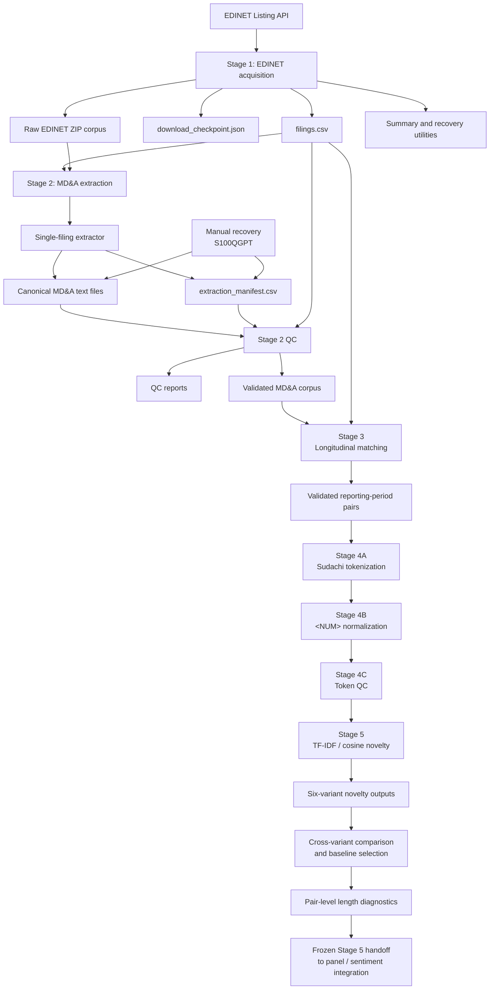
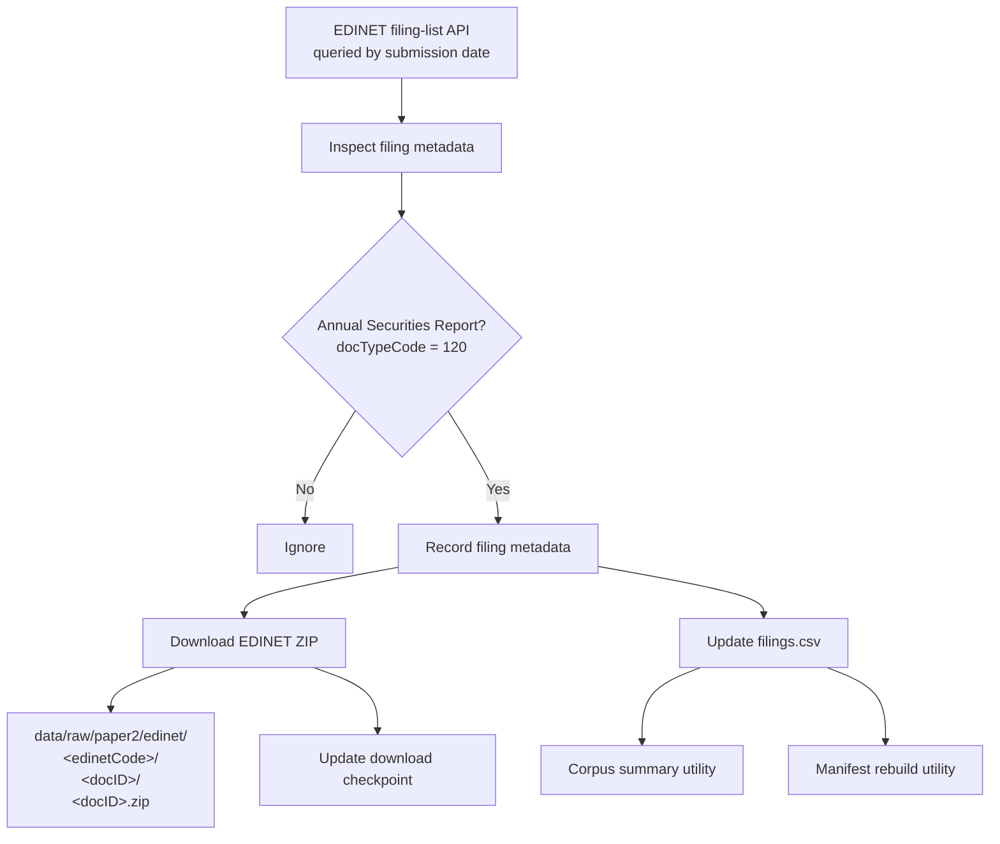
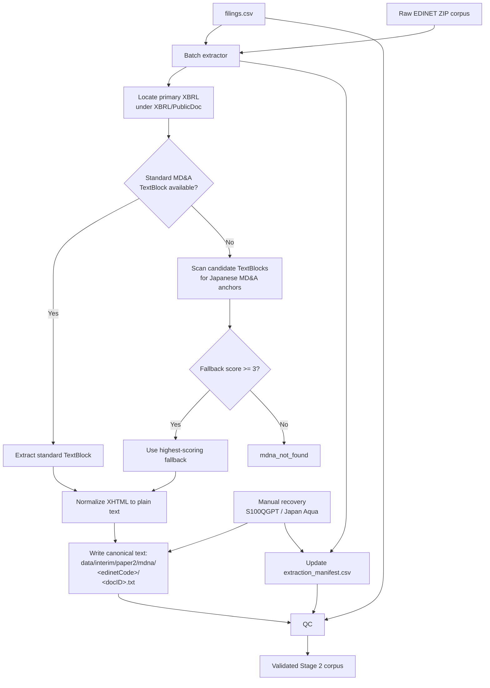
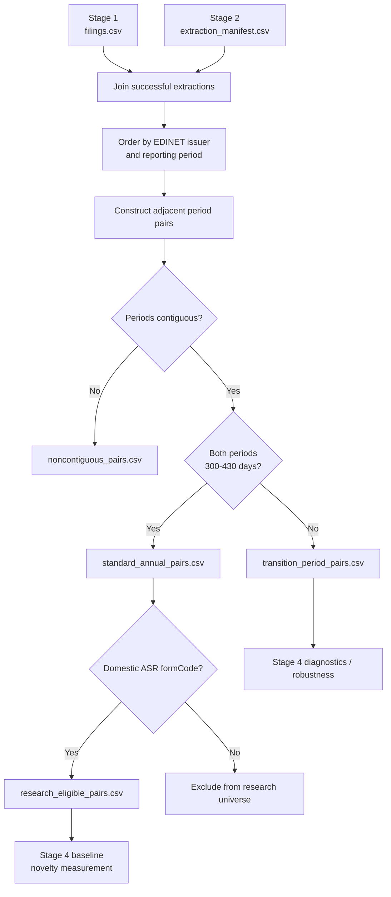
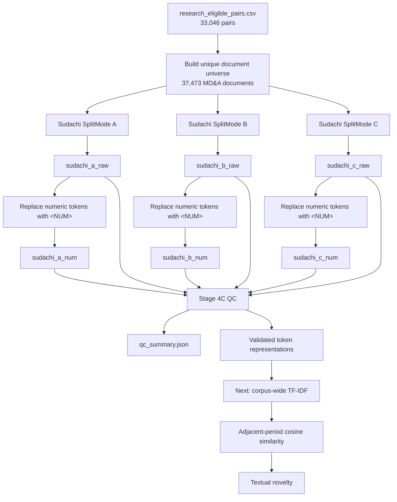
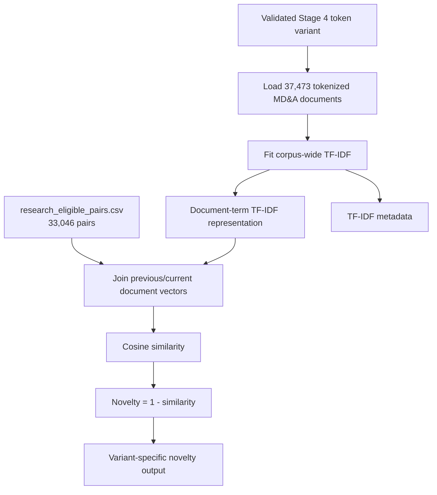

# Paper 2 Pipeline Overview

This document summarizes the implemented Paper 2 data pipeline through the completed Stage 6A analysis-panel foundation, including the frozen Stage 5 word-token textual-novelty layer and its reproducible visualization/QC outputs. Stages 1–3 cover EDINET acquisition, MD&A extraction, and longitudinal reporting-period matching. Stage 4 prepares six validated Japanese token representations. Stage 5 fits corpus-wide TF-IDF representations, computes adjacent-period cosine similarity / textual novelty for each variant, and produces descriptive and diagnostic novelty figures. Stage 6A now provides the canonical pair-level analysis-panel foundation; the next substantive step is Stage 6B sentiment measurement.

## Current Pipeline Status

- **Stage 1 — EDINET acquisition and filing manifest:** complete and frozen.
- **Stage 2 — MD&A extraction and quality control:** complete and frozen.
- **Stage 3 — Longitudinal reporting-period matching:** complete and frozen.
- **Stage 4 — Token representation construction and QC:** complete and validated.
- **Stage 5 — Word-token TF-IDF / cosine textual novelty:** complete, validated, and frozen. The primary specification is `sudachi_c_num`; `sudachi_c_raw` is the main representation robustness alternative, while Sudachi A/B variants are secondary robustness checks.
- **Stage 5 visualization / QC:** implemented for reproducible publication and diagnostic plots, including temporal novelty diagnostics and novelty-versus-length analysis.
- **Stage 6A — Analysis-panel foundation:** complete and validated; 33,046 rows × 41 columns, with zero missing joins across baseline/raw novelty and length diagnostics.
- **Stage 6B — Sentiment measurement:** next substantive stage; begin with LMMD dictionary/token compatibility QC, followed by Japanese Financial BERT and GPT document-level sentiment.

The current corpus contains **37,807 Annual Securities Reports** and **37,757 successfully extracted MD&A sections**.

---

## High-Level Pipeline



---

# Stage 1 — EDINET Acquisition

## Purpose

Stage 1 creates the canonical filing universe used by the rest of the pipeline. It retrieves EDINET filing metadata by date, identifies Annual Securities Reports, downloads the corresponding ZIP archives, and writes a reproducible filing manifest.

## Main Outputs

```text
data/raw/paper2/edinet/
    <edinetCode>/
        <docID>/
            <docID>.zip

data/interim/paper2/edinet/
    filings.csv
    download_checkpoint.json
```

The canonical filing manifest is:

```text
data/interim/paper2/edinet/filings.csv
```

Key metadata fields include:

```text
docID
edinetCode
secCode
JCN
filerName
ordinanceCode
formCode
docTypeCode
periodStart
periodEnd
submitDateTime
```

## Stage 1 Flow



## Final Stage 1 Corpus

Final validated counts:

| Metric | Count |
|---|---:|
| Filing rows | 37,807 |
| Unique `docID` values | 37,807 |
| Unique EDINET/security-code combinations | 4,448 |
| Unique `edinetCode × periodEnd.year` combinations | 37,724 |
| Apparent duplicate calendar-year groups | 83 |

Submission-date coverage:

```text
2016-09-20 10:01
through
2026-09-18 17:00
```

Fiscal-period coverage:

```text
2015-07-31
through
2026-06-30
```

The raw ZIP count matches the filing-manifest row count.

The 83 apparent duplicate calendar-year groups were later resolved in Stage 3. They were not true duplicate reporting periods; they primarily reflected legitimate fiscal-year-end changes that produced two reporting periods ending in the same calendar year.

## Important Design Decision: Listing Status

The current EDINET code list is used only as **current-state reference metadata**.

It is **not** used as a historical listing-status filter because doing so would introduce survivorship bias. Historical sample construction must therefore avoid assuming that today's EDINET code-list status accurately describes whether a company was listed at a past filing date.

Foreign or otherwise out-of-scope issuers are handled later through sample construction and QC rather than through a brittle historical listing filter.

## Stage 1 Utilities

Relevant utilities include:

```text
scripts/paper2/summarize_edinet_filings.py
rebuild_edinet_filings_manifest.py
```

These support corpus inspection and recovery without changing the canonical raw ZIP archive.

---

# Stage 2 — MD&A Extraction

## Purpose

Stage 2 extracts the Japanese MD&A section from each EDINET Annual Securities Report and converts it into canonical plain text suitable for downstream NLP analysis.

The extraction logic prioritizes standardized XBRL text-block tags and falls back to anchor-based matching only when necessary.

## Main Components

```text
src/mdna_analysis/mdna_extraction.py
src/mdna_analysis/extract_mdna_batch.py
scripts/paper2/extract_mdna_batch.py
scripts/paper2/qc_mdna_extraction.py
```

## Main Outputs

```text
data/interim/paper2/mdna/
    <edinetCode>/
        <docID>.txt

data/interim/paper2/mdna/
    extraction_manifest.csv

data/interim/paper2/mdna/qc/
    ...
```

The extracted `.txt` files are generated pipeline artifacts and are not intended for Git.

---

## Stage 2 Extraction Flow



---

## Primary MD&A XBRL Tags

The extractor first looks for standardized MD&A text-block local names:

```text
ManagementAnalysisOfFinancialPositionOperatingResultsAndCashFlowsTextBlock

AnalysisOfFinancialPositionOperatingResultsAndCashFlowsTextBlock
```

The primary XBRL document is selected from:

```text
XBRL/PublicDoc/
```

with preference for the Annual Securities Report (`-asr-`) document.

---

## Anchor-Based Fallback

When a standardized MD&A tag is unavailable, candidate `*TextBlock` elements are scored using Japanese anchor phrases including:

```text
経営者による財政状態
経営成績
キャッシュ・フロー
財政状態、経営成績及びキャッシュ
財政状態及び経営成績
```

A production fallback now requires:

```text
fallbackScore >= 3
```

This threshold was selected after manual inspection of fallback cases.

### Why the Threshold Matters

A score-1 fallback for Japan Aqua (`S100QGPT`) incorrectly selected a generic financial-summary table instead of the true MD&A.

By contrast, reviewed score-3 and score-5 fallback cases were legitimate MD&A sections.

The minimum score of 3 therefore prevents weak anchor matches from being accepted as valid MD&A text.

---

## Manual Recovery Case — S100QGPT

One valid Japanese filing required a one-off recovery:

```text
docID:      S100QGPT
edinetCode: E30126
company:    株式会社日本アクア
```

The filing contained a genuine human-readable MD&A section in the iXBRL HTML, but the section was not wrapped in a standard `ix:nonNumeric` MD&A TextBlock.

A dedicated recovery script:

```text
scripts/paper2/extract_mdna_S100QGPT.py
```

locates the exact MD&A section heading in the known iXBRL document and extracts the section until the following peer heading.

The extraction is written to the canonical output path and recorded in the manifest using:

```text
method = manual_ixbrl
```

This should be treated as an explicit documented exception rather than generalized into the primary parser.

---

# Stage 2 Quality Control

QC is performed by:

```text
scripts/paper2/qc_mdna_extraction.py
```

The QC process compares:

- the Stage 1 filing manifest,
- the Stage 2 extraction manifest,
- and the actual extracted text files.

## QC Outputs

```text
data/interim/paper2/mdna/qc/
    mdna_qc_summary.json
    status_counts.csv
    method_counts.csv
    failures.csv
    failures_by_edinet_code.csv
    fallback_cases.csv
    short_texts.csv
    long_texts.csv
    missing_from_extraction.csv
    extra_in_extraction.csv
    duplicate_docids_filings.csv
    duplicate_docids_extraction.csv
    output_file_issues.csv
```

## Final Stage 2 Results

| Metric | Count |
|---|---:|
| Stage 1 filing rows | 37,807 |
| Stage 2 manifest rows | 37,807 |
| Successful extractions | 37,757 |
| Failed extractions | 50 |
| Success rate | 99.8677% |
| Standard-tag successes | 37,752 |
| Anchor-fallback successes | 4 |
| Manual iXBRL recoveries | 1 |
| Missing Stage 2 rows | 0 |
| Extra Stage 2 rows | 0 |
| Output-file issues | 0 |
| Duplicate Stage 1 `docID` rows | 0 |
| Duplicate Stage 2 `docID` rows | 0 |

Text-length distribution:

| Statistic | Characters |
|---|---:|
| Minimum | 243 |
| 1st percentile | 971 |
| 5th percentile | 1,811 |
| Median | 6,216 |
| Mean | 6,749 |
| 95th percentile | 12,494 |
| 99th percentile | 20,936 |
| Maximum | 79,595 |

Short and long texts are retained as review flags rather than automatically excluded.

The known 243-character minimum is a manually reviewed legitimate short MD&A.

---

# Failure Interpretation

The remaining extraction failures appear concentrated in foreign or otherwise out-of-scope issuers rather than ordinary Japanese listed-company Annual Securities Reports.

Examples include:

```text
YTL Corporation Berhad
MediciNova, Inc.
Techpoint, Inc.
OMNI-PLUS SYSTEM LIMITED
YCP Holdings (Global) Limited
Aflac Incorporated
```

These failures are therefore expected to be handled during downstream sample construction rather than by weakening the MD&A extraction rules.

---

# Reproducibility and Git Policy

Generated corpus artifacts should remain outside Git.

Recommended exclusions include:

```gitignore
data/interim/paper2/mdna/**/*.txt
data/interim/paper2/mdna/qc/
```

Raw EDINET ZIP archives should also remain outside Git.

Git should contain:

- source code,
- scripts,
- configuration,
- documentation,
- and small reproducibility fixtures or summaries where useful.

---

# Stage 3 — Longitudinal Reporting-Period Matching

## Purpose

Stage 3 creates the canonical longitudinal MD&A pair sample used by Stage 4.

The stage is intentionally mechanical. It does not compute TF-IDF, cosine similarity, sentiment, or novelty. Its job is to determine which extracted disclosures are genuinely adjacent reporting periods for the same issuer and to preserve unusual reporting structures explicitly rather than hiding them inside a calendar-year convention.

## Main Components

```text
src/mdna_analysis/longitudinal_match.py
src/pipeline/stages/longitudinal_match.py
scripts/paper2/run_pipeline.py
```

The Stage 3 adapter inherits its input paths from the configured outputs of the prior stages by default, while preserving explicit override support.

## Why Reporting Periods, Not Calendar Years

An initial diagnostic defined a firm-year using:

```text
edinetCode + year(periodEnd)
```

This produced 83 apparent duplicate firm-years.

Manual inspection showed that these were largely legitimate cases in which a company changed its fiscal year-end. A typical sequence looked like:

```text
normal annual period
2024-04-01 -> 2025-03-31

transition period
2025-04-01 -> 2025-08-31
```

Both periods end in calendar year 2025, but they are distinct and contiguous reporting periods. Stage 3 therefore works directly with `periodStart` and `periodEnd`.

## Matching Logic

Within each `edinetCode`, filings are ordered by actual reporting period.

For each adjacent observation, Stage 3 computes:

```text
prev_period_days
curr_period_days
period_end_gap_days
start_after_prev_end_days
periods_contiguous
prev_standard_period
curr_standard_period
standard_annual_pair
pair_status
```

Two periods are contiguous when:

```text
curr_periodStart == prev_periodEnd + 1 day
```

A standard annual reporting period currently has duration between 300 and 430 days.

Adjacent pairs are classified as:

```text
standard_annual
transition_period
noncontiguous
```

`transition_period` means the periods are genuinely contiguous but at least one period has nonstandard duration, as often occurs when an issuer changes fiscal year-end.

`noncontiguous` means the next available filing does not begin immediately after the prior reporting period and therefore should not be treated as an ordinary year-over-year novelty comparison.

## Stage 3 Outputs

```text
data/interim/paper2/longitudinal/
    longitudinal_panel.csv
    duplicate_reporting_periods.csv
    adjacent_period_pairs.csv
    standard_annual_pairs.csv
    transition_period_pairs.csv
    noncontiguous_pairs.csv
    research_eligible_pairs.csv
    summary.json
```

## Final Stage 3 Results

| Metric | Count |
|---|---:|
| Stage 1 filing rows | 37,807 |
| Stage 2 manifest rows | 37,807 |
| Successful Stage 2 extractions | 37,757 |
| Matched Stage 3 panel rows | 37,757 |
| Matched EDINET codes | 4,441 |
| True duplicate reporting-period groups | 0 |
| Adjacent reporting-period pairs | 33,316 |
| Standard annual pairs | 33,046 |
| Transition-period pairs | 268 |
| Noncontiguous pairs | 2 |
| Domestic matched panel rows | 37,757 |
| Foreign matched panel rows | 0 |
| Domestic standard annual pairs | 33,046 |
| Foreign standard annual pairs | 0 |
| Research-eligible pairs | 33,046 |

The exact one-to-one match between successful Stage 2 extractions and Stage 3 panel rows provides a strong join-integrity check.

The absence of true duplicate reporting periods confirms that the earlier 83 apparent duplicate firm-years were an artifact of using calendar-year labels rather than actual reporting periods.

## Noncontiguous-Pair Validation

Only two adjacent available observations were classified as noncontiguous.

Manual investigation showed that both reflect genuine issuer/listing discontinuities rather than matching failures:

- **SBI Shinsei Bank:** the gap follows its 2023 delisting.
- **Sony Financial Group:** the gap reflects Sony's 2020 full acquisition / privatization and the later 2025 relisting associated with the partial spin-off.

These cases are retained for auditability but excluded from ordinary year-over-year novelty comparisons.

## Research-Universe Eligibility

The Stage 3 → Stage 4 boundary now includes an explicit domestic-company eligibility rule based on each filing's historical EDINET `formCode`.

The eligible domestic Annual Securities Report form codes are:

```text
030000
030200
040000
```

Foreign-company Annual Securities Reports use:

```text
080000
```

and are excluded from the Paper 2 research universe.

This rule is deliberately not embedded in Stage 1 acquisition or Stage 2 extraction. The earlier stages preserve the complete filing and extraction record, while Stage 3 defines the research-eligible longitudinal sample immediately before text-representation choices begin.

The rule currently changes **zero observations** in the baseline novelty sample:

```text
standard annual pairs:       33,046
domestic standard pairs:     33,046
foreign standard pairs:           0
research-eligible pairs:     33,046
```

The reason is that all 50 foreign-company filings in Stage 1 failed Stage 2 extraction, while all domestic-form filings extracted successfully. The explicit `formCode` criterion therefore future-proofs the sample definition so that improvements to the extractor cannot silently introduce foreign-company observations later.

The canonical Stage 4 input is:

```text
data/interim/paper2/longitudinal/research_eligible_pairs.csv
```

## Stage 3 Flow



Stage 3 should now be treated as **complete and frozen**.

---

# Stage 4 — Token Representation Construction

Stage 4 begins from the frozen Stage 3 research-eligible pair manifest and introduces the first explicit text-representation choices.

The canonical Stage 4 pair input is:

```text
data/interim/paper2/longitudinal/research_eligible_pairs.csv
```

This file contains **33,046 research-eligible adjacent standard annual pairs**. The union of documents appearing in those pairs contains **37,473 unique MD&A documents**.

Stage 4 is divided into three internal phases:

```text
4A — raw Sudachi tokenization
4B — numeric normalization
4C — cross-variant QC
```

Stage 5 uses the validated Stage 4 artifacts directly rather than repeating tokenization.

## Stage 4A — Raw Sudachi Tokenization

The production tokenization stage uses:

- Unicode NFKC normalization;
- SudachiPy morphological tokenization;
- natural-boundary chunking for large texts;
- raw numbers retained;
- punctuation/symbol-only tokens removed after tokenization;
- one token per output line.

Three Sudachi segmentation modes are generated:

```text
sudachi_a_raw
sudachi_b_raw
sudachi_c_raw
```

Final validated counts are:

| Variant | Documents | Total tokens | Mean tokens/document |
|---|---:|---:|---:|
| `sudachi_a_raw` | 37,473 | 113,574,929 | 3,030.8 |
| `sudachi_b_raw` | 37,473 | 109,407,286 | 2,919.6 |
| `sudachi_c_raw` | 37,473 | 105,993,616 | 2,828.5 |

The expected segmentation relationship holds for every document:

```text
tokenCount(A) >= tokenCount(B) >= tokenCount(C)
```

with zero violations.

Each raw variant is stored under:

```text
data/interim/paper2/tokens/
    sudachi_a_raw/
    sudachi_b_raw/
    sudachi_c_raw/
```

Each variant directory contains its own `manifest.csv`.

## Stage 4B — Numeric Normalization

Numeric normalization is implemented as a deterministic transformation of the existing raw token files rather than by rerunning Sudachi.

The final semantic normalization collapses numeric magnitude while preserving economically meaningful number classes:

```text
numeric magnitudes        -> <NUM>
percentages               -> <NUM>%
yen-denominated amounts   -> <NUM>円
```

Japanese scale markers such as `十`, `百`, `千`, `万`, `億`, and `兆` are treated as part of numeric magnitude rather than as independent semantic content. Thus expressions such as `1億`, `1億2万`, and `1兆1千億` collapse to `<NUM>`, while yen amounts collapse to `<NUM>円`.

Mixed alphanumeric or semantically meaningful expressions such as `3Q`, `2025年問題`, `1人`, and `100年企業` are intentionally retained.

The transformation remains one-input-token to one-output-token, so the number-normalized variants preserve document-level token counts exactly.

The derived variants are:

```text
sudachi_a_num
sudachi_b_num
sudachi_c_num
```

All three numeric variants contain **37,473 documents**, and document-level token counts match the corresponding raw variants exactly.

## Stage 4C — Quality Control

Stage 4 runs a dedicated cross-variant validator over all requested token representations.

The validator checks:

- manifest existence and required fields;
- duplicate `(edinetCode, docID)` keys;
- identical document universes across variants;
- failed or zero-token documents;
- physical token-file existence;
- consistent source metadata across raw variants;
- `A >= B >= C` token-count ordering;
- exact raw / `<NUM>` token-count equality;
- internally valid numeric replacement statistics.

The current QC summary reports:

```text
status = passed
documentCount = 37,473
missingFiles = 0
raw A<B violations = 0
raw B<C violations = 0
A raw/num token-count mismatches = 0
B raw/num token-count mismatches = 0
C raw/num token-count mismatches = 0
num A<B violations = 0
num B<C violations = 0
```

The machine-readable QC artifact is:

```text
data/interim/paper2/tokens/qc_summary.json
```

The Stage 4 token-preparation layer should therefore now be treated as **complete and validated**.

## Stage 4 Flow



## Local SSD Scratch Architecture

Stage 4 exposed a practical infrastructure constraint: directly reading and writing tens of thousands of small files over the NAS is substantially slower than local SSD I/O.

The pipeline now supports an optional local scratch layout:

```text
canonical repository / NAS paths:
data/interim/paper2/...

physical scratch paths:
~/paper2_stage4/...
```

Canonical manifests continue to record repo-relative logical paths. Machine-specific scratch paths are used only for physical I/O and are not persisted as canonical identifiers.

For Stage 4 tokenization on the M1 Max, local SSD processing improved throughput dramatically. Worker-count testing produced:

| Workers | Throughput |
|---:|---:|
| 6 | 569.1 docs/s |
| 8 | 744.3 docs/s |
| 10 | 751.1 docs/s |

The production setting is therefore **8 workers**, which captures nearly all available throughput without unnecessary process overhead.

Completed scratch artifacts are archived and transferred back to the canonical NAS location after validation. For large trees of small files, `tar.gz` plus SSH streaming is preferred for bulk movement, with `rsync -n` available as a verification pass.

## Stage 4 Outputs

```text
data/interim/paper2/tokens/
    sudachi_a_raw/
        manifest.csv
        <edinetCode>/
            <docID>.tokens.txt

    sudachi_b_raw/
        manifest.csv
        ...

    sudachi_c_raw/
        manifest.csv
        ...

    sudachi_a_num/
        manifest.csv
        ...

    sudachi_b_num/
        manifest.csv
        ...

    sudachi_c_num/
        manifest.csv
        ...

    qc_summary.json
```

Generated token files are pipeline artifacts and should remain outside Git.

# Stage 5 — Word-Token TF-IDF and Textual Novelty

## Purpose

Stage 5 converts each validated Stage 4 token representation into a corpus-wide TF-IDF representation and measures textual similarity between adjacent annual-report MD&A disclosures.

For each token variant, the stage operates on the same **37,473-document** universe and the same **33,046 research-eligible adjacent standard annual pairs**. This ensures that differences across Stage 5 outputs reflect representation choices rather than sample changes.

The baseline pair-level measure is:

```text
cosine_similarity = cosine(TFIDF_previous, TFIDF_current)
textual_novelty = 1 - cosine_similarity
```

The stage has now been run for all six token variants:

```text
sudachi_a_raw
sudachi_a_num
sudachi_b_raw
sudachi_b_num
sudachi_c_raw
sudachi_c_num
```

The architecture is deliberately variant-agnostic. Stage 5 does not hard-code a single baseline representation; the configured token variant determines the input artifact family, while the TF-IDF and pairwise cosine logic remains identical.

## Stage 5 Flow



## Final Stage 5 Results

All six word-token variants completed on the identical **37,473-document** corpus and **33,046-pair** research sample.

Final pair-level novelty summaries are:

| Variant | Mean novelty | Median novelty |
|---|---:|---:|
| `sudachi_a_raw` | 0.106852 | 0.088598 |
| `sudachi_b_raw` | 0.109630 | 0.091106 |
| `sudachi_c_raw` | 0.111810 | 0.093010 |
| `sudachi_a_num` | 0.049687 | 0.034892 |
| `sudachi_b_num` | 0.051269 | 0.036312 |
| `sudachi_c_num` | 0.052434 | 0.037234 |

The Sudachi A/B/C choices are extremely similar within the raw family and within the number-normalized family. Pairwise correlations are approximately 0.997–0.999 within each family, indicating that segmentation mode has little effect on the ranking of firm-year novelty.

Raw versus number-normalized novelty is meaningfully different. Pearson correlations remain high at roughly 0.88, while Spearman correlations are around 0.71. Number normalization therefore changes not only the level of novelty but also the ranking of some firm-year observations.

The primary word-token novelty specification is now:

```text
baseline_variant = sudachi_c_num
```

The main representation robustness alternative is:

```text
sudachi_c_raw
```

Sudachi A/B variants are retained as secondary robustness checks rather than equally weighted candidate baselines.

## Pair-Level Length Diagnostics

Stage 5 also writes a representation-independent:

```text
data/interim/paper2/novelty/pair_diagnostics.csv
```

derived directly from the Stage 3 `prev_textChars` and `curr_textChars` fields.

The diagnostics include:

```text
prevMdnaLength
currMdnaLength
lengthRatio
logLengthChange
absLogLengthChange
```

For the 33,046 research-eligible pairs:

- median `lengthRatio` is approximately **1.013**;
- median `absLogLengthChange` is approximately **0.059**;
- the 95th percentile of `absLogLengthChange` is approximately **1.130**;
- the 99th percentile is approximately **1.798**.

Length change is strongly related to baseline C-num novelty. In the full sample:

```text
Pearson corr(novelty, absLogLengthChange)  = 0.797
Spearman corr(novelty, absLogLengthChange) = 0.592
```

The relationship remains meaningful after excluding extreme length changes:

| Sample | Pearson | Spearman |
|---|---:|---:|
| Full sample | 0.797 | 0.592 |
| Drop top 1% absolute length change | 0.758 | 0.580 |
| Drop top 5% | 0.633 | 0.526 |
| Drop top 10% | 0.491 | 0.454 |

This indicates that disclosure expansion/contraction is an important systematic component of textual novelty, not merely an artifact of a few extreme filings.

The empirical design will therefore keep the novelty measure intact and use `absLogLengthChange` as a main control. Signed `logLengthChange` and exclusions of extreme length-change observations will be used as robustness specifications. Novelty will not be residualized against length, and no baseline winsorization is currently planned.

## Stage 5 Validation and Freeze

Source-text spot checks were performed on absolute-maximum novelty cases and on observations around the 99th percentile.

The extreme maximum tail includes genuine but unusually large changes in disclosure scope or structure, including major expansions and contractions of the MD&A section. Around the 99th percentile, high novelty generally corresponds to coherent, economically meaningful disclosure changes rather than extraction failure.

The final Stage 5 validation reports:

```text
pair rows = 33,046
duplicate pairs = 0
missing pair-diagnostic values = 0
```

All six variant means and medians reproduce exactly after the Stage 5 code cleanup.

Stage 5 should therefore now be treated as **complete, validated, and frozen**.

## Stage 5 Visualization / QC Layer

A separate plotting layer generates reproducible descriptive and diagnostic outputs from the frozen Stage 5 artifacts. Plotting is intentionally separated from TF-IDF/novelty computation so that figures can be regenerated without recomputing the text representations.

The planned/generated figure family includes:

```text
outputs/paper2/figures/novelty/
    annual_novelty_summary.csv
    paper/
        novelty_distribution.pdf / .png
        novelty_by_fiscal_year.pdf / .png
    diagnostics/
        novelty_raw_vs_normalized_scatter.pdf / .png
        novelty_raw_vs_normalized_by_year.pdf / .png
        novelty_vs_length_change.pdf / .png
        novelty_by_year_boxplot.pdf / .png
```

The annual summary exposes a pronounced 2018 discontinuity. C-num novelty for fiscal-year 2018 reports has a mean of approximately **0.146** and median of approximately **0.134**, versus approximately **0.052** and **0.038** in 2019. The broad-based shift coincides with the Japanese FSA narrative-disclosure reform effective for fiscal years ending on or after March 31, 2018. The baseline sample retains 2018, while an exclusion of the 2018 regulatory-transition observations is planned as a robustness specification.

The novelty-versus-length visualization documents the strong relationship already quantified in `pair_diagnostics.csv`. This figure should be retained as a candidate appendix or main-text diagnostic because it motivates the `absLogLengthChange` control and the planned length-tail robustness tests. A further diagnostic should assess whether the 2018 novelty discontinuity remains after accounting for MD&A length change.

## Next Pipeline Step — Stage 6

Stage 6 should begin with an analysis-panel foundation before sentiment models are run. The canonical panel should establish one auditable row per research-eligible adjacent annual pair and integrate:

- baseline `sudachi_c_num` novelty;
- `sudachi_c_raw` and other representation robustness measures;
- `absLogLengthChange` and signed length-change diagnostics;
- identifiers and dates needed for subsequent sentiment and market-data joins;
- sentiment outputs (Stage 6B);
- market-reaction outcomes (subsequent integration);
- firm/year/industry identifiers and fixed-effect variables.

Character 3–5-gram novelty remains a planned tokenizer-robustness branch rather than a blocker for the main panel construction.

---

# Design Principles Established So Far

The implemented stages establish several project-wide principles:

- preserve raw source material;
- maintain canonical manifests between stages;
- make stages restartable and auditable;
- treat generated NLP corpora as pipeline artifacts rather than source code;
- prefer explicit QC over silent exclusions;
- document special-case recoveries;
- avoid historical-listing filters based on current EDINET metadata;
- freeze completed stages before downstream modeling;
- separate mechanical data construction from methodological choices.

These principles should continue through Stage 4 and later empirical stages.

# Stage 6A — Analysis-Panel Foundation

## Purpose

Stage 6A creates the canonical pair-level foundation for subsequent sentiment, market-reaction, and regression work. It deliberately starts from the frozen Stage 3 research-eligible pair manifest rather than treating a Stage 5 variant output as the authoritative sample.

The stage joins Stage 5 measures strictly on:

```text
edinetCode + prev_docID + curr_docID
```

and preserves the full Stage 3 pair metadata.

## Inputs and Measures

Stage 6A incorporates:

```text
baseline novelty:    sudachi_c_num
robustness novelty:  sudachi_c_raw

pair diagnostics:
    prevMdnaLength
    currMdnaLength
    lengthRatio
    logLengthChange
    absLogLengthChange
```

The canonical output is:

```text
data/interim/paper2/analysis/analysis_panel.csv
```

with a companion metadata JSON recording inputs, join diagnostics, dimensions, and novelty summaries.

## Validation

The completed Stage 6A panel contains:

| Metric | Result |
|---|---:|
| Rows | 33,046 |
| Columns | 41 |
| Missing C-num novelty/cosine joins | 0 |
| Missing C-raw novelty/cosine joins | 0 |
| Missing length-diagnostic joins | 0 |

The C-num and C-raw novelty means and medians exactly reproduce the frozen Stage 5 summaries, providing an additional end-to-end integrity check.

Stage 6A should therefore be treated as **complete and validated**. Later sentiment and market-reaction measures should be produced independently and joined to this canonical foundation.

# Next — Stage 6B Sentiment Measurement

The immediate next task is document-level sentiment measurement. The first substep is an LMMD dictionary/token compatibility diagnostic using the validated Stage 4 `sudachi_c_raw` representation. This will measure actual Japanese dictionary coverage before full-sample LMMD scoring. The Paper 1 lexical scoring concept can then be retained while the surrounding implementation is adapted to the Paper 2 `edinetCode + docID` architecture.

Japanese Financial BERT and GPT sentiment should follow as independent document-level measures, with comparable outputs suitable for joining to the Stage 6A panel.

