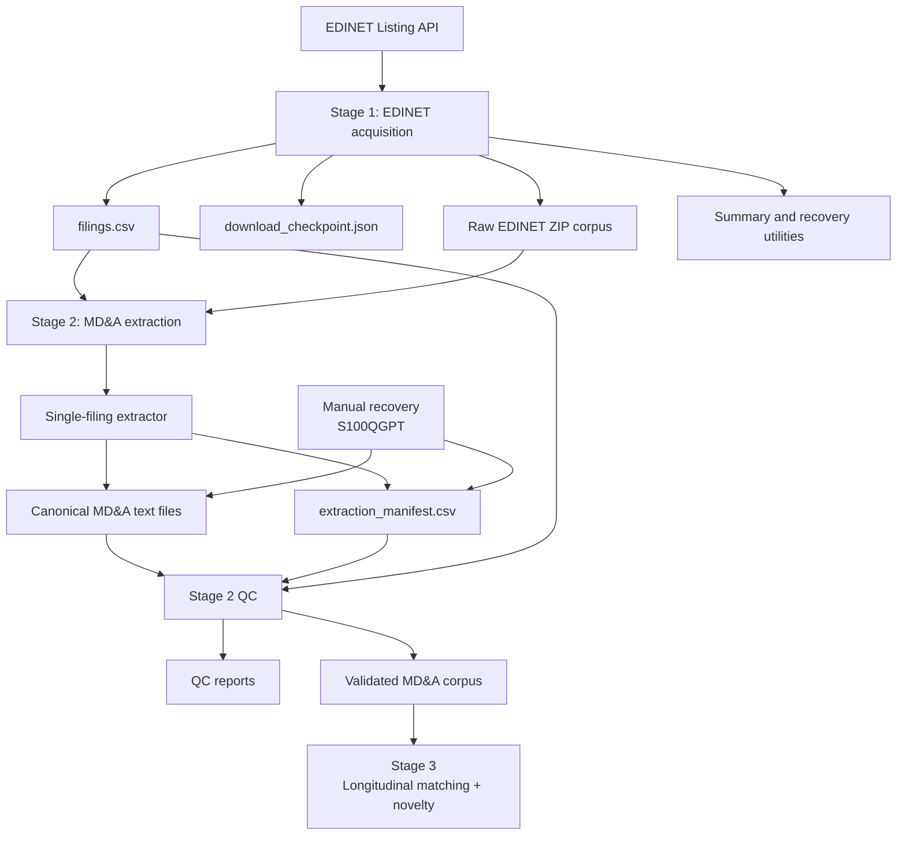
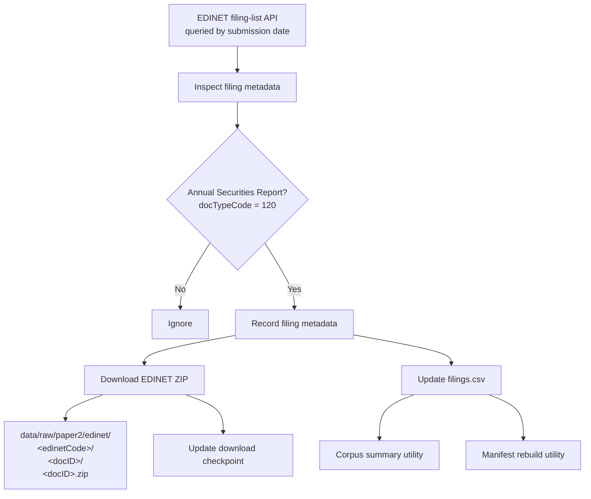
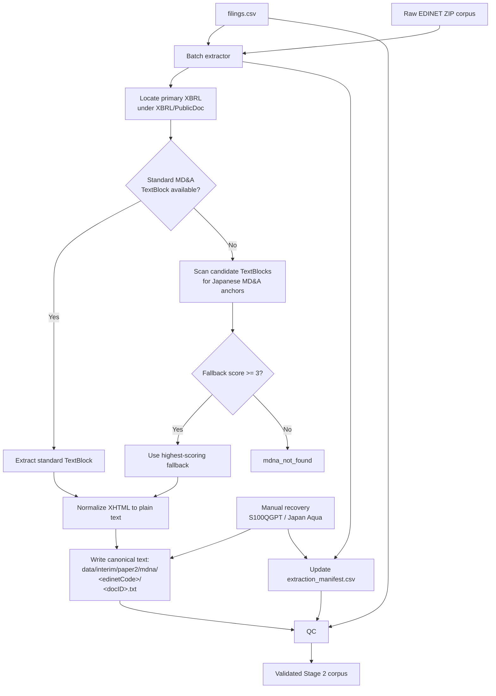
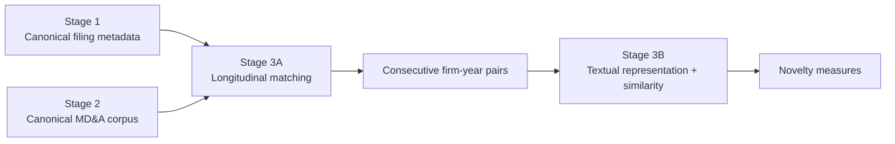

# Paper 2 Pipeline Overview

This document summarizes the implemented data pipeline for Paper 2 through the completion of Stage 2. It is intended as project documentation for the EDINET acquisition and MD&A extraction workflow before Stage 3 longitudinal matching and novelty measurement begin.

## Current Pipeline Status

- **Stage 1 — EDINET acquisition and filing manifest:** complete and frozen.
- **Stage 2 — MD&A extraction and quality control:** complete and frozen.
- **Stage 3 — Longitudinal matching and textual novelty:** next.

The current corpus contains **37,807 Annual Securities Reports** and **37,757 successfully extracted MD&A sections**.

---

## High-Level Pipeline



---

# Stage 1 — EDINET Acquisition

## Purpose

Stage 1 creates the canonical filing universe used by the rest of the pipeline. It retrieves EDINET filing metadata by date, identifies Annual Securities Reports, downloads the corresponding ZIP archives, and writes a reproducible filing manifest.

## Main Outputs

```text
data/raw/paper2/edinet/
    <edinetCode>/
        <docID>/
            <docID>.zip

data/interim/paper2/edinet/
    filings.csv
    download_checkpoint.json
```

The canonical filing manifest is:

```text
data/interim/paper2/edinet/filings.csv
```

Key metadata fields include:

```text
docID
edinetCode
secCode
JCN
filerName
ordinanceCode
formCode
docTypeCode
periodStart
periodEnd
submitDateTime
```

## Stage 1 Flow



## Final Stage 1 Corpus

Final validated counts:

| Metric | Count |
|---|---:|
| Filing rows | 37,807 |
| Unique `docID` values | 37,807 |
| Unique EDINET/security-code combinations | 4,448 |
| Unique firm-years | 37,724 |
| Duplicate firm-years requiring later review | 83 |

Submission-date coverage:

```text
2016-09-20 10:01
through
2026-09-18 17:00
```

Fiscal-period coverage:

```text
2015-07-31
through
2026-06-30
```

The raw ZIP count matches the filing-manifest row count.

## Important Design Decision: Listing Status

The current EDINET code list is used only as **current-state reference metadata**.

It is **not** used as a historical listing-status filter because doing so would introduce survivorship bias. Historical sample construction must therefore avoid assuming that today's EDINET code-list status accurately describes whether a company was listed at a past filing date.

Foreign or otherwise out-of-scope issuers are handled later through sample construction and QC rather than through a brittle historical listing filter.

## Stage 1 Utilities

Relevant utilities include:

```text
scripts/paper2/summarize_edinet_filings.py
rebuild_edinet_filings_manifest.py
```

These support corpus inspection and recovery without changing the canonical raw ZIP archive.

---

# Stage 2 — MD&A Extraction

## Purpose

Stage 2 extracts the Japanese MD&A section from each EDINET Annual Securities Report and converts it into canonical plain text suitable for downstream NLP analysis.

The extraction logic prioritizes standardized XBRL text-block tags and falls back to anchor-based matching only when necessary.

## Main Components

```text
src/mdna_analysis/mdna_extraction.py
src/mdna_analysis/extract_mdna_batch.py
scripts/paper2/extract_mdna_batch.py
scripts/paper2/qc_mdna_extraction.py
```

## Main Outputs

```text
data/interim/paper2/mdna/
    <edinetCode>/
        <docID>.txt

data/interim/paper2/mdna/
    extraction_manifest.csv

data/interim/paper2/mdna/qc/
    ...
```

The extracted `.txt` files are generated pipeline artifacts and are not intended for Git.

---

## Stage 2 Extraction Flow



---

## Primary MD&A XBRL Tags

The extractor first looks for standardized MD&A text-block local names:

```text
ManagementAnalysisOfFinancialPositionOperatingResultsAndCashFlowsTextBlock

AnalysisOfFinancialPositionOperatingResultsAndCashFlowsTextBlock
```

The primary XBRL document is selected from:

```text
XBRL/PublicDoc/
```

with preference for the Annual Securities Report (`-asr-`) document.

---

## Anchor-Based Fallback

When a standardized MD&A tag is unavailable, candidate `*TextBlock` elements are scored using Japanese anchor phrases including:

```text
経営者による財政状態
経営成績
キャッシュ・フロー
財政状態、経営成績及びキャッシュ
財政状態及び経営成績
```

A production fallback now requires:

```text
fallbackScore >= 3
```

This threshold was selected after manual inspection of fallback cases.

### Why the Threshold Matters

A score-1 fallback for Japan Aqua (`S100QGPT`) incorrectly selected a generic financial-summary table instead of the true MD&A.

By contrast, reviewed score-3 and score-5 fallback cases were legitimate MD&A sections.

The minimum score of 3 therefore prevents weak anchor matches from being accepted as valid MD&A text.

---

## Manual Recovery Case — S100QGPT

One valid Japanese filing required a one-off recovery:

```text
docID:      S100QGPT
edinetCode: E30126
company:    株式会社日本アクア
```

The filing contained a genuine human-readable MD&A section in the iXBRL HTML, but the section was not wrapped in a standard `ix:nonNumeric` MD&A TextBlock.

A dedicated recovery script:

```text
scripts/paper2/extract_mdna_S100QGPT.py
```

locates the exact MD&A section heading in the known iXBRL document and extracts the section until the following peer heading.

The extraction is written to the canonical output path and recorded in the manifest using:

```text
method = manual_ixbrl
```

This should be treated as an explicit documented exception rather than generalized into the primary parser.

---

# Stage 2 Quality Control

QC is performed by:

```text
scripts/paper2/qc_mdna_extraction.py
```

The QC process compares:

- the Stage 1 filing manifest,
- the Stage 2 extraction manifest,
- and the actual extracted text files.

## QC Outputs

```text
data/interim/paper2/mdna/qc/
    mdna_qc_summary.json
    status_counts.csv
    method_counts.csv
    failures.csv
    failures_by_edinet_code.csv
    fallback_cases.csv
    short_texts.csv
    long_texts.csv
    missing_from_extraction.csv
    extra_in_extraction.csv
    duplicate_docids_filings.csv
    duplicate_docids_extraction.csv
    output_file_issues.csv
```

## Final Stage 2 Results

| Metric | Count |
|---|---:|
| Stage 1 filing rows | 37,807 |
| Stage 2 manifest rows | 37,807 |
| Successful extractions | 37,757 |
| Failed extractions | 50 |
| Success rate | 99.8677% |
| Standard-tag successes | 37,752 |
| Anchor-fallback successes | 4 |
| Manual iXBRL recoveries | 1 |
| Missing Stage 2 rows | 0 |
| Extra Stage 2 rows | 0 |
| Output-file issues | 0 |
| Duplicate Stage 1 `docID` rows | 0 |
| Duplicate Stage 2 `docID` rows | 0 |

Text-length distribution:

| Statistic | Characters |
|---|---:|
| Minimum | 243 |
| 1st percentile | 971 |
| 5th percentile | 1,811 |
| Median | 6,216 |
| Mean | 6,749 |
| 95th percentile | 12,494 |
| 99th percentile | 20,936 |
| Maximum | 79,595 |

Short and long texts are retained as review flags rather than automatically excluded.

The known 243-character minimum is a manually reviewed legitimate short MD&A.

---

# Failure Interpretation

The remaining extraction failures appear concentrated in foreign or otherwise out-of-scope issuers rather than ordinary Japanese listed-company Annual Securities Reports.

Examples include:

```text
YTL Corporation Berhad
MediciNova, Inc.
Techpoint, Inc.
OMNI-PLUS SYSTEM LIMITED
YCP Holdings (Global) Limited
Aflac Incorporated
```

These failures are therefore expected to be handled during downstream sample construction rather than by weakening the MD&A extraction rules.

---

# Reproducibility and Git Policy

Generated corpus artifacts should remain outside Git.

Recommended exclusions include:

```gitignore
data/interim/paper2/mdna/**/*.txt
data/interim/paper2/mdna/qc/
```

Raw EDINET ZIP archives should also remain outside Git.

Git should contain:

- source code,
- scripts,
- configuration,
- documentation,
- and small reproducibility fixtures or summaries where useful.

---

# Pipeline Boundary After Stage 2

The output of Stage 2 is a validated corpus of canonical Japanese MD&A text plus filing and extraction metadata.

Stage 3 should consume these outputs without modifying them.

Conceptually:



---

# Stage 3 Handoff

Before computing textual similarity, Stage 3A should first construct a clean longitudinal panel.

Required tasks include:

1. merge successful Stage 2 extractions with Stage 1 filing metadata;
2. order reports by firm and fiscal period;
3. investigate the **83 duplicate firm-year observations** rather than automatically dropping them;
4. identify valid consecutive-year filing pairs;
5. inspect fiscal-period spacing and unusual reporting periods;
6. attach text-length and extraction metadata;
7. freeze the eligible firm-year pair manifest.

Only after the longitudinal panel is validated should Stage 3B construct novelty measures.

Current methodological candidates for Stage 3B include:

- corpus-wide TF-IDF cosine similarity;
- numerical-normalized TF-IDF similarity;
- Japanese word-tokenized TF-IDF;
- character n-gram TF-IDF as a tokenizer-robust alternative;
- firm-specific TF-IDF as a diagnostic or robustness measure;
- industry-relative and firm-relative novelty transformations.

The baseline design should remain simple, with alternative representations retained for robustness analysis rather than multiplying primary hypotheses.

---

# Design Principles Established So Far

The first two stages establish several project-wide principles:

- preserve raw source material;
- maintain canonical manifests between stages;
- make stages restartable and auditable;
- treat generated NLP corpora as pipeline artifacts rather than source code;
- prefer explicit QC over silent exclusions;
- document special-case recoveries;
- avoid historical-listing filters based on current EDINET metadata;
- freeze completed stages before downstream modeling;
- separate mechanical data construction from methodological choices.

These principles should continue through Stage 3 and later empirical stages.
