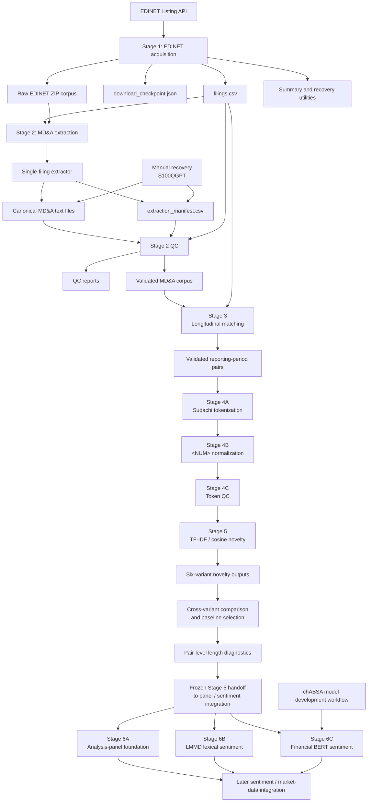
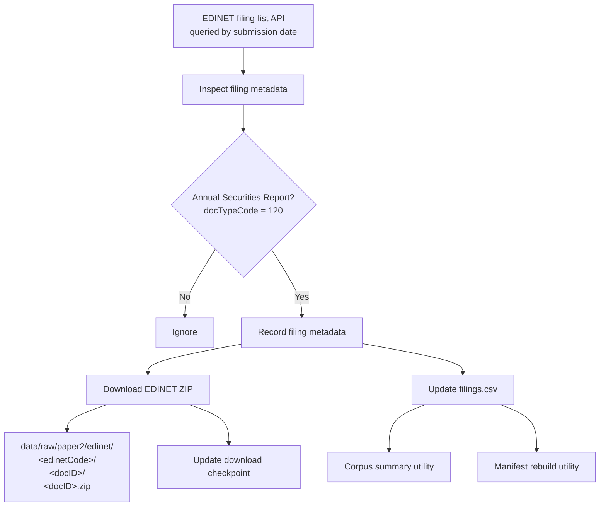
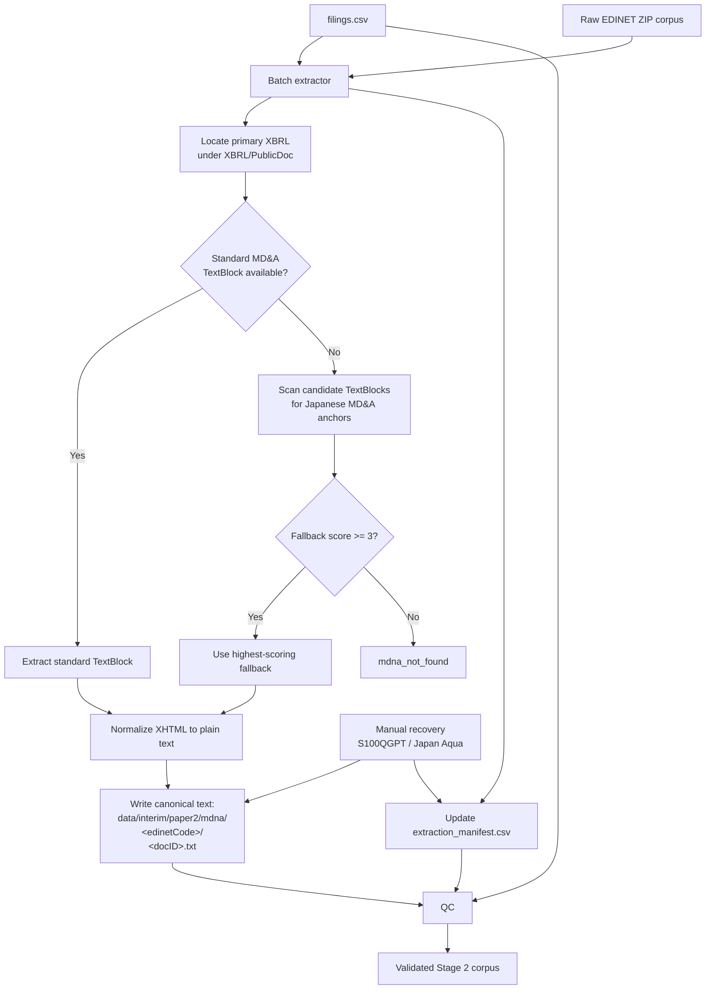
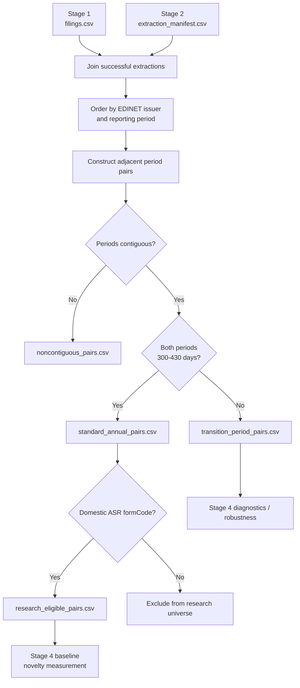
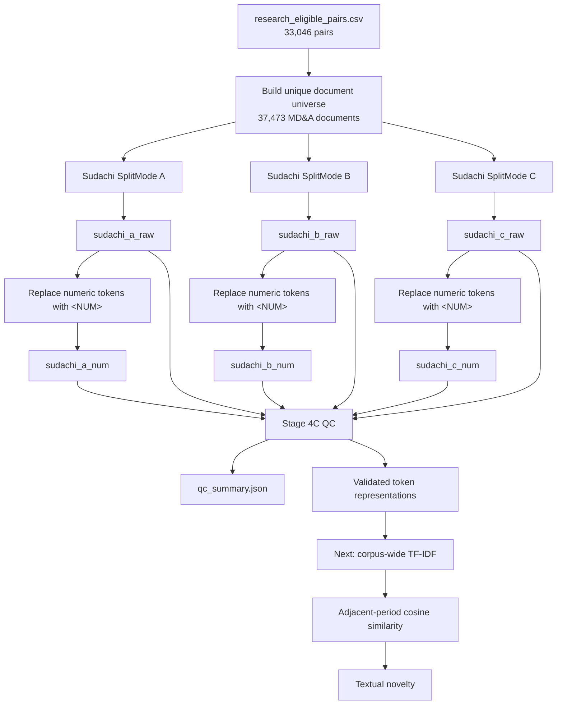
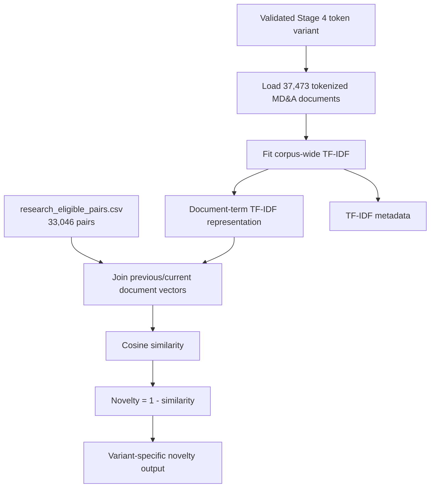

# Paper 2 Pipeline Overview

This document summarizes the implemented Paper 2 data pipeline through
Stage 6C contextual sentiment and the completed Stage 7A--7C foundation
for market-reaction construction. Stages 1--3 cover EDINET acquisition,
MD&A extraction, and longitudinal reporting-period matching. Stage 4
prepares six validated Japanese token representations. Stage 5 fits
corpus-wide TF-IDF representations, computes adjacent-period cosine
similarity / textual novelty for each variant, and produces descriptive
and diagnostic novelty figures. Stage 6A provides the frozen
analysis-panel foundation. Stage 6B provides the completed and frozen
LMMD lexical sentiment benchmark. Stage 6C provides the completed and
frozen Japanese Financial BERT measure using two chABSA-fine-tuned
binary classifiers; full-corpus scoring and sentiment/novelty
diagnostics are complete.

## Current Pipeline Status

-   **Stage 1 --- EDINET acquisition and filing manifest:** complete and
    frozen.
-   **Stage 2 --- MD&A extraction and quality control:** complete and
    frozen.
-   **Stage 3 --- Longitudinal reporting-period matching:** complete and
    frozen.
-   **Stage 4 --- Token representation construction and QC:** complete
    and validated.
-   **Stage 5 --- Word-token TF-IDF / cosine textual novelty:**
    complete, validated, and frozen. The primary specification is
    `sudachi_c_num`; `sudachi_c_raw` is the main representation
    robustness alternative, while Sudachi A/B variants are secondary
    robustness checks.
-   **Stage 5 visualization / QC:** implemented for reproducible
    publication and diagnostic plots, including temporal novelty
    diagnostics and novelty-versus-length analysis.
-   **Stage 6A --- Analysis-panel foundation:** complete and validated;
    33,046 rows × 41 columns, with zero missing joins across
    baseline/raw novelty and length diagnostics.
-   **Stage 6B --- LMMD lexical sentiment:** complete, validated, and
    frozen for all 37,473 research-universe documents.
-   **Stage 6C --- Japanese Financial BERT contextual sentiment:**
    complete, full-corpus scored, diagnostically validated, and frozen
    for all 37,473 research-universe documents. Full-sample LMMD
    comparison and novelty-disagreement diagnostics are complete.
-   **Stage 6D --- GPT / generative sentiment:** not yet implemented and
    intentionally deferred while Stage 7 market-reaction construction proceeds.
-   **Stage 7A --- Market-event eligibility and price coverage:** complete,
    validated, and frozen. Of 33,046 research-eligible filing events,
    32,134 (97.24%) satisfy the TSE listing-history and estimation-window
    requirements.
-   **Stage 7B --- Timestamp-aware event trading dates:** complete,
    validated, and frozen for all 32,134 Stage 7A-eligible events. The
    canonical assignment uses the EDINET submission timestamp, the observed
    TSE trading calendar, and regime-specific 15:00 / 15:30 JST close times.
-   **Stage 7C --- TOPIX market-return preparation:** complete, validated,
    and frozen. Official J-Quants TOPIX contains 2,440 daily observations
    from 2016-09-28 through 2026-09-25; all 32,134 Stage 7B events have the
    full 101 TOPIX observations in the inclusive `[-120,-20]` estimation
    window. Stage 7D market-model estimation is next.

The current corpus contains **37,807 Annual Securities Reports** and
**37,757 successfully extracted MD&A sections**.

------------------------------------------------------------------------

## High-Level Pipeline


``` mermaid
flowchart TD

    A[EDINET Listing API] --> B[Stage 1: EDINET acquisition]

    B --> C[filings.csv]
    B --> D[download_checkpoint.json]
    B --> E[Raw EDINET ZIP corpus]
    B --> F[Summary and recovery utilities]

    C --> G[Stage 2: MD&A extraction]
    E --> G

    G --> H[Single-filing extractor]
    H --> I[Canonical MD&A text files]
    H --> J[extraction_manifest.csv]

    I --> K[Stage 2 QC]
    J --> K
    C --> K

    K --> L[QC reports]
    K --> M[Validated MD&A corpus]

    N[Manual recovery<br/>S100QGPT] --> I
    N --> J

    M --> O[Stage 3<br/>Longitudinal matching]
    C --> O
    O --> P[Validated reporting-period pairs]
    P --> Q[Stage 4A<br/>Sudachi tokenization]
    Q --> R[Stage 4B<br/>&lt;NUM&gt; normalization]
    R --> S[Stage 4C<br/>Token QC]
    S --> T[Stage 5<br/>TF-IDF / cosine novelty]
    T --> U[Six-variant novelty outputs]
    U --> V[Cross-variant comparison<br/>and baseline selection]
    V --> W[Pair-level length diagnostics]
    W --> X[Frozen Stage 5 handoff<br/>to panel / sentiment integration]
    X --> Y[Stage 6A<br/>Analysis-panel foundation]
    X --> Z[Stage 6B<br/>LMMD lexical sentiment]
    X --> AA[Stage 6C<br/>Financial BERT sentiment]
    AB[chABSA model-development workflow] --> AA
    Y --> AC[Later sentiment / market-data integration]
    Z --> AC
    AA --> AC
```

------------------------------------------------------------------------

# Stage 1 --- EDINET Acquisition

## Purpose

Stage 1 creates the canonical filing universe used by the rest of the
pipeline. It retrieves EDINET filing metadata by date, identifies Annual
Securities Reports, downloads the corresponding ZIP archives, and writes
a reproducible filing manifest.

## Main Outputs

``` text
data/raw/paper2/edinet/
    <edinetCode>/
        <docID>/
            <docID>.zip

data/interim/paper2/edinet/
    filings.csv
    download_checkpoint.json
```

The canonical filing manifest is:

``` text
data/interim/paper2/edinet/filings.csv
```

Key metadata fields include:

``` text
docID
edinetCode
secCode
JCN
filerName
ordinanceCode
formCode
docTypeCode
periodStart
periodEnd
submitDateTime
```

## Stage 1 Flow


``` mermaid
flowchart TD

    A1[EDINET filing-list API<br/>queried by submission date]

    A1 --> A2[Inspect filing metadata]

    A2 --> A3{Annual Securities Report?<br/>docTypeCode = 120}

    A3 -- No --> A4[Ignore]
    A3 -- Yes --> A5[Record filing metadata]

    A5 --> A6[Download EDINET ZIP]

    A6 --> A7[
        data/raw/paper2/edinet/
        &lt;edinetCode&gt;/
        &lt;docID&gt;/
        &lt;docID&gt;.zip
    ]

    A5 --> A8[Update filings.csv]

    A6 --> A9[Update download checkpoint]

    A8 --> A10[Corpus summary utility]
    A8 --> A11[Manifest rebuild utility]
```

## Final Stage 1 Corpus

Final validated counts:

  Metric                                                 Count
  --------------------------------------------------- --------
  Filing rows                                           37,807
  Unique `docID` values                                 37,807
  Unique EDINET/security-code combinations               4,448
  Unique `edinetCode × periodEnd.year` combinations     37,724
  Apparent duplicate calendar-year groups                   83

Submission-date coverage:

``` text
2016-09-20 10:01
through
2026-09-18 17:00
```

Fiscal-period coverage:

``` text
2015-07-31
through
2026-06-30
```

The raw ZIP count matches the filing-manifest row count.

The 83 apparent duplicate calendar-year groups were later resolved in
Stage 3. They were not true duplicate reporting periods; they primarily
reflected legitimate fiscal-year-end changes that produced two reporting
periods ending in the same calendar year.

## Important Design Decision: Listing Status

The current EDINET code list is used only as **current-state reference
metadata**.

It is **not** used as a historical listing-status filter because doing
so would introduce survivorship bias. Historical sample construction
must therefore avoid assuming that today's EDINET code-list status
accurately describes whether a company was listed at a past filing date.

Foreign or otherwise out-of-scope issuers are handled later through
sample construction and QC rather than through a brittle historical
listing filter.

## Stage 1 Utilities

Relevant utilities include:

``` text
scripts/paper2/summarize_edinet_filings.py
rebuild_edinet_filings_manifest.py
```

These support corpus inspection and recovery without changing the
canonical raw ZIP archive.

------------------------------------------------------------------------

# Stage 2 --- MD&A Extraction

## Purpose

Stage 2 extracts the Japanese MD&A section from each EDINET Annual
Securities Report and converts it into canonical plain text suitable for
downstream NLP analysis.

The extraction logic prioritizes standardized XBRL text-block tags and
falls back to anchor-based matching only when necessary.

## Main Components

``` text
src/mdna_analysis/mdna_extraction.py
src/mdna_analysis/extract_mdna_batch.py
scripts/paper2/extract_mdna_batch.py
scripts/paper2/qc_mdna_extraction.py
```

## Main Outputs

``` text
data/interim/paper2/mdna/
    <edinetCode>/
        <docID>.txt

data/interim/paper2/mdna/
    extraction_manifest.csv

data/interim/paper2/mdna/qc/
    ...
```

The extracted `.txt` files are generated pipeline artifacts and are not
intended for Git.

------------------------------------------------------------------------

## Stage 2 Extraction Flow


``` mermaid
flowchart TD

    B1[filings.csv]
    B2[Raw EDINET ZIP corpus]

    B1 --> B3[Batch extractor]
    B2 --> B3

    B3 --> B4[Locate primary XBRL<br/>under XBRL/PublicDoc]

    B4 --> B5{Standard MD&A<br/>TextBlock available?}

    B5 -- Yes --> B6[Extract standard TextBlock]

    B5 -- No --> B7[Scan candidate TextBlocks<br/>for Japanese MD&A anchors]

    B7 --> B8{Fallback score >= 3?}

    B8 -- Yes --> B9[Use highest-scoring fallback]
    B8 -- No --> B10[mdna_not_found]

    B6 --> B11[Normalize XHTML to plain text]
    B9 --> B11

    B11 --> B12[
        Write canonical text:
        data/interim/paper2/mdna/
        &lt;edinetCode&gt;/
        &lt;docID&gt;.txt
    ]

    B3 --> B13[Update extraction_manifest.csv]

    B12 --> B14[QC]
    B13 --> B14
    B1 --> B14

    B15[Manual recovery<br/>S100QGPT / Japan Aqua] --> B12
    B15 --> B13

    B14 --> B16[Validated Stage 2 corpus]
```

------------------------------------------------------------------------

## Primary MD&A XBRL Tags

The extractor first looks for standardized MD&A text-block local names:

``` text
ManagementAnalysisOfFinancialPositionOperatingResultsAndCashFlowsTextBlock

AnalysisOfFinancialPositionOperatingResultsAndCashFlowsTextBlock
```

The primary XBRL document is selected from:

``` text
XBRL/PublicDoc/
```

with preference for the Annual Securities Report (`-asr-`) document.

------------------------------------------------------------------------

## Anchor-Based Fallback

When a standardized MD&A tag is unavailable, candidate `*TextBlock`
elements are scored using Japanese anchor phrases including:

``` text
経営者による財政状態
経営成績
キャッシュ・フロー
財政状態、経営成績及びキャッシュ
財政状態及び経営成績
```

A production fallback now requires:

``` text
fallbackScore >= 3
```

This threshold was selected after manual inspection of fallback cases.

### Why the Threshold Matters

A score-1 fallback for Japan Aqua (`S100QGPT`) incorrectly selected a
generic financial-summary table instead of the true MD&A.

By contrast, reviewed score-3 and score-5 fallback cases were legitimate
MD&A sections.

The minimum score of 3 therefore prevents weak anchor matches from being
accepted as valid MD&A text.

------------------------------------------------------------------------

## Manual Recovery Case --- S100QGPT

One valid Japanese filing required a one-off recovery:

``` text
docID:      S100QGPT
edinetCode: E30126
company:    株式会社日本アクア
```

The filing contained a genuine human-readable MD&A section in the iXBRL
HTML, but the section was not wrapped in a standard `ix:nonNumeric` MD&A
TextBlock.

A dedicated recovery script:

``` text
scripts/paper2/extract_mdna_S100QGPT.py
```

locates the exact MD&A section heading in the known iXBRL document and
extracts the section until the following peer heading.

The extraction is written to the canonical output path and recorded in
the manifest using:

``` text
method = manual_ixbrl
```

This should be treated as an explicit documented exception rather than
generalized into the primary parser.

------------------------------------------------------------------------

# Stage 2 Quality Control

QC is performed by:

``` text
scripts/paper2/qc_mdna_extraction.py
```

The QC process compares:

-   the Stage 1 filing manifest,
-   the Stage 2 extraction manifest,
-   and the actual extracted text files.

## QC Outputs

``` text
data/interim/paper2/mdna/qc/
    mdna_qc_summary.json
    status_counts.csv
    method_counts.csv
    failures.csv
    failures_by_edinet_code.csv
    fallback_cases.csv
    short_texts.csv
    long_texts.csv
    missing_from_extraction.csv
    extra_in_extraction.csv
    duplicate_docids_filings.csv
    duplicate_docids_extraction.csv
    output_file_issues.csv
```

## Final Stage 2 Results

  Metric                                Count
  -------------------------------- ----------
  Stage 1 filing rows                  37,807
  Stage 2 manifest rows                37,807
  Successful extractions               37,757
  Failed extractions                       50
  Success rate                       99.8677%
  Standard-tag successes               37,752
  Anchor-fallback successes                 4
  Manual iXBRL recoveries                   1
  Missing Stage 2 rows                      0
  Extra Stage 2 rows                        0
  Output-file issues                        0
  Duplicate Stage 1 `docID` rows            0
  Duplicate Stage 2 `docID` rows            0

Text-length distribution:

  Statistic           Characters
  ----------------- ------------
  Minimum                    243
  1st percentile             971
  5th percentile           1,811
  Median                   6,216
  Mean                     6,749
  95th percentile         12,494
  99th percentile         20,936
  Maximum                 79,595

Short and long texts are retained as review flags rather than
automatically excluded.

The known 243-character minimum is a manually reviewed legitimate short
MD&A.

------------------------------------------------------------------------

# Failure Interpretation

The remaining extraction failures appear concentrated in foreign or
otherwise out-of-scope issuers rather than ordinary Japanese
listed-company Annual Securities Reports.

Examples include:

``` text
YTL Corporation Berhad
MediciNova, Inc.
Techpoint, Inc.
OMNI-PLUS SYSTEM LIMITED
YCP Holdings (Global) Limited
Aflac Incorporated
```

These failures are therefore expected to be handled during downstream
sample construction rather than by weakening the MD&A extraction rules.

------------------------------------------------------------------------

# Reproducibility and Git Policy

Generated corpus artifacts should remain outside Git.

Recommended exclusions include:

``` gitignore
data/interim/paper2/mdna/**/*.txt
data/interim/paper2/mdna/qc/
```

Raw EDINET ZIP archives should also remain outside Git.

Git should contain:

-   source code,
-   scripts,
-   configuration,
-   documentation,
-   and small reproducibility fixtures or summaries where useful.

------------------------------------------------------------------------

# Stage 3 --- Longitudinal Reporting-Period Matching

## Purpose

Stage 3 creates the canonical longitudinal MD&A pair sample used by
Stage 4.

The stage is intentionally mechanical. It does not compute TF-IDF,
cosine similarity, sentiment, or novelty. Its job is to determine which
extracted disclosures are genuinely adjacent reporting periods for the
same issuer and to preserve unusual reporting structures explicitly
rather than hiding them inside a calendar-year convention.

## Main Components

``` text
src/mdna_analysis/longitudinal_match.py
src/pipeline/stages/longitudinal_match.py
scripts/paper2/run_pipeline.py
```

The Stage 3 adapter inherits its input paths from the configured outputs
of the prior stages by default, while preserving explicit override
support.

## Why Reporting Periods, Not Calendar Years

An initial diagnostic defined a firm-year using:

``` text
edinetCode + year(periodEnd)
```

This produced 83 apparent duplicate firm-years.

Manual inspection showed that these were largely legitimate cases in
which a company changed its fiscal year-end. A typical sequence looked
like:

``` text
normal annual period
2024-04-01 -> 2025-03-31

transition period
2025-04-01 -> 2025-08-31
```

Both periods end in calendar year 2025, but they are distinct and
contiguous reporting periods. Stage 3 therefore works directly with
`periodStart` and `periodEnd`.

## Matching Logic

Within each `edinetCode`, filings are ordered by actual reporting
period.

For each adjacent observation, Stage 3 computes:

``` text
prev_period_days
curr_period_days
period_end_gap_days
start_after_prev_end_days
periods_contiguous
prev_standard_period
curr_standard_period
standard_annual_pair
pair_status
```

Two periods are contiguous when:

``` text
curr_periodStart == prev_periodEnd + 1 day
```

A standard annual reporting period currently has duration between 300
and 430 days.

Adjacent pairs are classified as:

``` text
standard_annual
transition_period
noncontiguous
```

`transition_period` means the periods are genuinely contiguous but at
least one period has nonstandard duration, as often occurs when an
issuer changes fiscal year-end.

`noncontiguous` means the next available filing does not begin
immediately after the prior reporting period and therefore should not be
treated as an ordinary year-over-year novelty comparison.

## Stage 3 Outputs

``` text
data/interim/paper2/longitudinal/
    longitudinal_panel.csv
    duplicate_reporting_periods.csv
    adjacent_period_pairs.csv
    standard_annual_pairs.csv
    transition_period_pairs.csv
    noncontiguous_pairs.csv
    research_eligible_pairs.csv
    summary.json
```

## Final Stage 3 Results

  Metric                                      Count
  ---------------------------------------- --------
  Stage 1 filing rows                        37,807
  Stage 2 manifest rows                      37,807
  Successful Stage 2 extractions             37,757
  Matched Stage 3 panel rows                 37,757
  Matched EDINET codes                        4,441
  True duplicate reporting-period groups          0
  Adjacent reporting-period pairs            33,316
  Standard annual pairs                      33,046
  Transition-period pairs                       268
  Noncontiguous pairs                             2
  Domestic matched panel rows                37,757
  Foreign matched panel rows                      0
  Domestic standard annual pairs             33,046
  Foreign standard annual pairs                   0
  Research-eligible pairs                    33,046

The exact one-to-one match between successful Stage 2 extractions and
Stage 3 panel rows provides a strong join-integrity check.

The absence of true duplicate reporting periods confirms that the
earlier 83 apparent duplicate firm-years were an artifact of using
calendar-year labels rather than actual reporting periods.

## Noncontiguous-Pair Validation

Only two adjacent available observations were classified as
noncontiguous.

Manual investigation showed that both reflect genuine issuer/listing
discontinuities rather than matching failures:

-   **SBI Shinsei Bank:** the gap follows its 2023 delisting.
-   **Sony Financial Group:** the gap reflects Sony's 2020 full
    acquisition / privatization and the later 2025 relisting associated
    with the partial spin-off.

These cases are retained for auditability but excluded from ordinary
year-over-year novelty comparisons.

## Research-Universe Eligibility

The Stage 3 → Stage 4 boundary now includes an explicit domestic-company
eligibility rule based on each filing's historical EDINET `formCode`.

The eligible domestic Annual Securities Report form codes are:

``` text
030000
030200
040000
```

Foreign-company Annual Securities Reports use:

``` text
080000
```

and are excluded from the Paper 2 research universe.

This rule is deliberately not embedded in Stage 1 acquisition or Stage 2
extraction. The earlier stages preserve the complete filing and
extraction record, while Stage 3 defines the research-eligible
longitudinal sample immediately before text-representation choices
begin.

The rule currently changes **zero observations** in the baseline novelty
sample:

``` text
standard annual pairs:       33,046
domestic standard pairs:     33,046
foreign standard pairs:           0
research-eligible pairs:     33,046
```

The reason is that all 50 foreign-company filings in Stage 1 failed
Stage 2 extraction, while all domestic-form filings extracted
successfully. The explicit `formCode` criterion therefore future-proofs
the sample definition so that improvements to the extractor cannot
silently introduce foreign-company observations later.

The canonical Stage 4 input is:

``` text
data/interim/paper2/longitudinal/research_eligible_pairs.csv
```

## Stage 3 Flow


``` mermaid
flowchart TD

    A[Stage 1<br/>filings.csv]
    B[Stage 2<br/>extraction_manifest.csv]

    A --> C[Join successful extractions]
    B --> C

    C --> D[Order by EDINET issuer<br/>and reporting period]
    D --> E[Construct adjacent period pairs]

    E --> F{Periods contiguous?}

    F -- No --> G[noncontiguous_pairs.csv]
    F -- Yes --> H{Both periods<br/>300-430 days?}

    H -- Yes --> I[standard_annual_pairs.csv]
    H -- No --> J[transition_period_pairs.csv]

    I --> K{Domestic ASR formCode?}
    K -- Yes --> L[research_eligible_pairs.csv]
    K -- No --> M[Exclude from research universe]

    L --> N[Stage 4 baseline<br/>novelty measurement]
    J --> O[Stage 4 diagnostics / robustness]
```

Stage 3 should now be treated as **complete and frozen**.

------------------------------------------------------------------------

# Stage 4 --- Token Representation Construction

Stage 4 begins from the frozen Stage 3 research-eligible pair manifest
and introduces the first explicit text-representation choices.

The canonical Stage 4 pair input is:

``` text
data/interim/paper2/longitudinal/research_eligible_pairs.csv
```

This file contains **33,046 research-eligible adjacent standard annual
pairs**. The union of documents appearing in those pairs contains
**37,473 unique MD&A documents**.

Stage 4 is divided into three internal phases:

``` text
4A — raw Sudachi tokenization
4B — numeric normalization
4C — cross-variant QC
```

Stage 5 uses the validated Stage 4 artifacts directly rather than
repeating tokenization.

## Stage 4A --- Raw Sudachi Tokenization

The production tokenization stage uses:

-   Unicode NFKC normalization;
-   SudachiPy morphological tokenization;
-   natural-boundary chunking for large texts;
-   raw numbers retained;
-   punctuation/symbol-only tokens removed after tokenization;
-   one token per output line.

Three Sudachi segmentation modes are generated:

``` text
sudachi_a_raw
sudachi_b_raw
sudachi_c_raw
```

Final validated counts are:

  Variant             Documents   Total tokens   Mean tokens/document
  ----------------- ----------- -------------- ----------------------
  `sudachi_a_raw`        37,473    113,574,929                3,030.8
  `sudachi_b_raw`        37,473    109,407,286                2,919.6
  `sudachi_c_raw`        37,473    105,993,616                2,828.5

The expected segmentation relationship holds for every document:

``` text
tokenCount(A) >= tokenCount(B) >= tokenCount(C)
```

with zero violations.

Each raw variant is stored under:

``` text
data/interim/paper2/tokens/
    sudachi_a_raw/
    sudachi_b_raw/
    sudachi_c_raw/
```

Each variant directory contains its own `manifest.csv`.

## Stage 4B --- Numeric Normalization

Numeric normalization is implemented as a deterministic transformation
of the existing raw token files rather than by rerunning Sudachi.

The final semantic normalization collapses numeric magnitude while
preserving economically meaningful number classes:

``` text
numeric magnitudes        -> <NUM>
percentages               -> <NUM>%
yen-denominated amounts   -> <NUM>円
```

Japanese scale markers such as `十`, `百`, `千`, `万`, `億`, and `兆`
are treated as part of numeric magnitude rather than as independent
semantic content. Thus expressions such as `1億`, `1億2万`, and
`1兆1千億` collapse to `<NUM>`, while yen amounts collapse to `<NUM>円`.

Mixed alphanumeric or semantically meaningful expressions such as `3Q`,
`2025年問題`, `1人`, and `100年企業` are intentionally retained.

The transformation remains one-input-token to one-output-token, so the
number-normalized variants preserve document-level token counts exactly.

The derived variants are:

``` text
sudachi_a_num
sudachi_b_num
sudachi_c_num
```

All three numeric variants contain **37,473 documents**, and
document-level token counts match the corresponding raw variants
exactly.

## Stage 4C --- Quality Control

Stage 4 runs a dedicated cross-variant validator over all requested
token representations.

The validator checks:

-   manifest existence and required fields;
-   duplicate `(edinetCode, docID)` keys;
-   identical document universes across variants;
-   failed or zero-token documents;
-   physical token-file existence;
-   consistent source metadata across raw variants;
-   `A >= B >= C` token-count ordering;
-   exact raw / `<NUM>` token-count equality;
-   internally valid numeric replacement statistics.

The current QC summary reports:

``` text
status = passed
documentCount = 37,473
missingFiles = 0
raw A<B violations = 0
raw B<C violations = 0
A raw/num token-count mismatches = 0
B raw/num token-count mismatches = 0
C raw/num token-count mismatches = 0
num A<B violations = 0
num B<C violations = 0
```

The machine-readable QC artifact is:

``` text
data/interim/paper2/tokens/qc_summary.json
```

The Stage 4 token-preparation layer should therefore now be treated as
**complete and validated**.

## Stage 4 Flow


``` mermaid
flowchart TD

    A[research_eligible_pairs.csv<br/>33,046 pairs]
    A --> B[Build unique document universe<br/>37,473 MD&A documents]

    B --> C1[Sudachi SplitMode A]
    B --> C2[Sudachi SplitMode B]
    B --> C3[Sudachi SplitMode C]

    C1 --> D1[sudachi_a_raw]
    C2 --> D2[sudachi_b_raw]
    C3 --> D3[sudachi_c_raw]

    D1 --> E1[Replace numeric tokens with &lt;NUM&gt;]
    D2 --> E2[Replace numeric tokens with &lt;NUM&gt;]
    D3 --> E3[Replace numeric tokens with &lt;NUM&gt;]

    E1 --> F1[sudachi_a_num]
    E2 --> F2[sudachi_b_num]
    E3 --> F3[sudachi_c_num]

    D1 --> G[Stage 4C QC]
    D2 --> G
    D3 --> G
    F1 --> G
    F2 --> G
    F3 --> G

    G --> H[qc_summary.json]
    G --> I[Validated token representations]

    I --> J[Next: corpus-wide TF-IDF]
    J --> K[Adjacent-period cosine similarity]
    K --> L[Textual novelty]
```

## Local SSD Scratch Architecture

Stage 4 exposed a practical infrastructure constraint: directly reading
and writing tens of thousands of small files over the NAS is
substantially slower than local SSD I/O.

The pipeline now supports an optional local scratch layout:

``` text
canonical repository / NAS paths:
data/interim/paper2/...

physical scratch paths:
~/paper2_stage4/...
```

Canonical manifests continue to record repo-relative logical paths.
Machine-specific scratch paths are used only for physical I/O and are
not persisted as canonical identifiers.

For Stage 4 tokenization on the M1 Max, local SSD processing improved
throughput dramatically. Worker-count testing produced:

    Workers     Throughput
  --------- --------------
          6   569.1 docs/s
          8   744.3 docs/s
         10   751.1 docs/s

The production setting is therefore **8 workers**, which captures nearly
all available throughput without unnecessary process overhead.

Completed scratch artifacts are archived and transferred back to the
canonical NAS location after validation. For large trees of small files,
`tar.gz` plus SSH streaming is preferred for bulk movement, with
`rsync -n` available as a verification pass.

## Stage 4 Outputs

``` text
data/interim/paper2/tokens/
    sudachi_a_raw/
        manifest.csv
        <edinetCode>/
            <docID>.tokens.txt

    sudachi_b_raw/
        manifest.csv
        ...

    sudachi_c_raw/
        manifest.csv
        ...

    sudachi_a_num/
        manifest.csv
        ...

    sudachi_b_num/
        manifest.csv
        ...

    sudachi_c_num/
        manifest.csv
        ...

    qc_summary.json
```

Generated token files are pipeline artifacts and should remain outside
Git.

# Stage 5 --- Word-Token TF-IDF and Textual Novelty

## Purpose

Stage 5 converts each validated Stage 4 token representation into a
corpus-wide TF-IDF representation and measures textual similarity
between adjacent annual-report MD&A disclosures.

For each token variant, the stage operates on the same
**37,473-document** universe and the same **33,046 research-eligible
adjacent standard annual pairs**. This ensures that differences across
Stage 5 outputs reflect representation choices rather than sample
changes.

The baseline pair-level measure is:

``` text
cosine_similarity = cosine(TFIDF_previous, TFIDF_current)
textual_novelty = 1 - cosine_similarity
```

The stage has now been run for all six token variants:

``` text
sudachi_a_raw
sudachi_a_num
sudachi_b_raw
sudachi_b_num
sudachi_c_raw
sudachi_c_num
```

The architecture is deliberately variant-agnostic. Stage 5 does not
hard-code a single baseline representation; the configured token variant
determines the input artifact family, while the TF-IDF and pairwise
cosine logic remains identical.

## Stage 5 Flow


``` mermaid
flowchart TD

    A[Validated Stage 4 token variant] --> B[Load 37,473 tokenized MD&A documents]
    B --> C[Fit corpus-wide TF-IDF]
    C --> D[Document-term TF-IDF representation]
    E[research_eligible_pairs.csv<br/>33,046 pairs] --> F[Join previous/current document vectors]
    D --> F
    F --> G[Cosine similarity]
    G --> H[Novelty = 1 - similarity]
    H --> I[Variant-specific novelty output]
    C --> J[TF-IDF metadata]
```

## Final Stage 5 Results

All six word-token variants completed on the identical
**37,473-document** corpus and **33,046-pair** research sample.

Final pair-level novelty summaries are:

  Variant             Mean novelty   Median novelty
  ----------------- -------------- ----------------
  `sudachi_a_raw`         0.106852         0.088598
  `sudachi_b_raw`         0.109630         0.091106
  `sudachi_c_raw`         0.111810         0.093010
  `sudachi_a_num`         0.049687         0.034892
  `sudachi_b_num`         0.051269         0.036312
  `sudachi_c_num`         0.052434         0.037234

The Sudachi A/B/C choices are extremely similar within the raw family
and within the number-normalized family. Pairwise correlations are
approximately 0.997--0.999 within each family, indicating that
segmentation mode has little effect on the ranking of firm-year novelty.

Raw versus number-normalized novelty is meaningfully different. Pearson
correlations remain high at roughly 0.88, while Spearman correlations
are around 0.71. Number normalization therefore changes not only the
level of novelty but also the ranking of some firm-year observations.

The primary word-token novelty specification is now:

``` text
baseline_variant = sudachi_c_num
```

The main representation robustness alternative is:

``` text
sudachi_c_raw
```

Sudachi A/B variants are retained as secondary robustness checks rather
than equally weighted candidate baselines.

## Pair-Level Length Diagnostics

Stage 5 also writes a representation-independent:

``` text
data/interim/paper2/novelty/pair_diagnostics.csv
```

derived directly from the Stage 3 `prev_textChars` and `curr_textChars`
fields.

The diagnostics include:

``` text
prevMdnaLength
currMdnaLength
lengthRatio
logLengthChange
absLogLengthChange
```

For the 33,046 research-eligible pairs:

-   median `lengthRatio` is approximately **1.013**;
-   median `absLogLengthChange` is approximately **0.059**;
-   the 95th percentile of `absLogLengthChange` is approximately
    **1.130**;
-   the 99th percentile is approximately **1.798**.

Length change is strongly related to baseline C-num novelty. In the full
sample:

``` text
Pearson corr(novelty, absLogLengthChange)  = 0.797
Spearman corr(novelty, absLogLengthChange) = 0.592
```

The relationship remains meaningful after excluding extreme length
changes:

  Sample                                 Pearson   Spearman
  ------------------------------------ --------- ----------
  Full sample                              0.797      0.592
  Drop top 1% absolute length change       0.758      0.580
  Drop top 5%                              0.633      0.526
  Drop top 10%                             0.491      0.454

This indicates that disclosure expansion/contraction is an important
systematic component of textual novelty, not merely an artifact of a few
extreme filings.

The empirical design will therefore keep the novelty measure intact and
use `absLogLengthChange` as a main control. Signed `logLengthChange` and
exclusions of extreme length-change observations will be used as
robustness specifications. Novelty will not be residualized against
length, and no baseline winsorization is currently planned.

## Stage 5 Validation and Freeze

Source-text spot checks were performed on absolute-maximum novelty cases
and on observations around the 99th percentile.

The extreme maximum tail includes genuine but unusually large changes in
disclosure scope or structure, including major expansions and
contractions of the MD&A section. Around the 99th percentile, high
novelty generally corresponds to coherent, economically meaningful
disclosure changes rather than extraction failure.

The final Stage 5 validation reports:

``` text
pair rows = 33,046
duplicate pairs = 0
missing pair-diagnostic values = 0
```

All six variant means and medians reproduce exactly after the Stage 5
code cleanup.

Stage 5 should therefore now be treated as **complete, validated, and
frozen**.

## Stage 5 Visualization / QC Layer

A separate plotting layer generates reproducible descriptive and
diagnostic outputs from the frozen Stage 5 artifacts. Plotting is
intentionally separated from TF-IDF/novelty computation so that figures
can be regenerated without recomputing the text representations.

The planned/generated figure family includes:

``` text
outputs/paper2/figures/novelty/
    annual_novelty_summary.csv
    paper/
        novelty_distribution.pdf / .png
        novelty_by_fiscal_year.pdf / .png
    diagnostics/
        novelty_raw_vs_normalized_scatter.pdf / .png
        novelty_raw_vs_normalized_by_year.pdf / .png
        novelty_vs_length_change.pdf / .png
        novelty_by_year_boxplot.pdf / .png
```

The annual summary exposes a pronounced 2018 discontinuity. C-num
novelty for fiscal-year 2018 reports has a mean of approximately
**0.146** and median of approximately **0.134**, versus approximately
**0.052** and **0.038** in 2019. The broad-based shift coincides with
the Japanese FSA narrative-disclosure reform effective for fiscal years
ending on or after March 31, 2018. The baseline sample retains 2018,
while an exclusion of the 2018 regulatory-transition observations is
planned as a robustness specification.

The novelty-versus-length visualization documents the strong
relationship already quantified in `pair_diagnostics.csv`. This figure
should be retained as a candidate appendix or main-text diagnostic
because it motivates the `absLogLengthChange` control and the planned
length-tail robustness tests. A further diagnostic should assess whether
the 2018 novelty discontinuity remains after accounting for MD&A length
change.

## Stage 5 Handoff to Stage 6

Stage 5 hands the frozen novelty artifacts to Stage 6 without
recomputing text representations. Stage 6A has now implemented the
analysis-panel foundation, establishing one auditable row per
research-eligible adjacent annual pair and integrating:

-   baseline `sudachi_c_num` novelty;
-   `sudachi_c_raw` representation robustness novelty;
-   `absLogLengthChange` and signed length-change diagnostics;
-   identifiers and dates needed for subsequent sentiment and
    market-data joins.

Sentiment is deliberately constructed independently at the document
level: Stage 6B produces the frozen LMMD lexical measure and Stage 6C
produces the Financial BERT contextual measure. These outputs are joined
to the Stage 6A foundation only after their own construction and
validation. Market-reaction outcomes and firm/year/industry fixed-effect
variables are subsequent integration steps.

Character 3--5-gram novelty remains a planned tokenizer-robustness
branch rather than a blocker for the main panel.

------------------------------------------------------------------------

# Design Principles Established So Far

The implemented stages establish several project-wide principles:

-   preserve raw source material;
-   maintain canonical manifests between stages;
-   make stages restartable and auditable;
-   treat generated NLP corpora as pipeline artifacts rather than source
    code;
-   prefer explicit QC over silent exclusions;
-   document special-case recoveries;
-   avoid historical-listing filters based on current EDINET metadata;
-   freeze completed stages before downstream modeling;
-   separate mechanical data construction from methodological choices.

These principles continue through the sentiment and later empirical
stages.

# Stage 6A --- Analysis-Panel Foundation

## Purpose

Stage 6A creates the canonical pair-level foundation for subsequent
sentiment, market-reaction, and regression work. It deliberately starts
from the frozen Stage 3 research-eligible pair manifest rather than
treating a Stage 5 variant output as the authoritative sample.

The stage joins Stage 5 measures strictly on:

``` text
edinetCode + prev_docID + curr_docID
```

and preserves the full Stage 3 pair metadata.

## Inputs and Measures

Stage 6A incorporates:

``` text
baseline novelty:    sudachi_c_num
robustness novelty:  sudachi_c_raw

pair diagnostics:
    prevMdnaLength
    currMdnaLength
    lengthRatio
    logLengthChange
    absLogLengthChange
```

The canonical output is:

``` text
data/interim/paper2/analysis/analysis_panel.csv
```

with a companion metadata JSON recording inputs, join diagnostics,
dimensions, and novelty summaries.

## Validation

The completed Stage 6A panel contains:

  Metric                                 Result
  ------------------------------------ --------
  Rows                                   33,046
  Columns                                    41
  Missing C-num novelty/cosine joins          0
  Missing C-raw novelty/cosine joins          0
  Missing length-diagnostic joins             0

The C-num and C-raw novelty means and medians exactly reproduce the
frozen Stage 5 summaries, providing an additional end-to-end integrity
check.

Stage 6A should therefore be treated as **complete and validated**.
Later sentiment and market-reaction measures should be produced
independently and joined to this canonical foundation.

# Stage 6B --- LMMD Lexical Sentiment Benchmark

## LMMD Dictionary / Token Compatibility QC

Before production LMMD scoring, the translated Loughran--McDonald
dictionary was checked against the validated Stage 4 `sudachi_c_raw`
token corpus. This QC is deliberately separate from production scoring
so that dictionary compatibility decisions are documented before
sentiment is joined to the analysis panel.

The Paper 1 LMMD resource contains **86,553 dictionary rows**, of which
**2,692** are sentiment-bearing: **347 positive** and **2,345 negative**
source entries. There are no English source entries classified
simultaneously as positive and negative.

Of the 2,692 sentiment-bearing entries, **2,689 have a `GPT_JA`
translation (99.89%)**. The translated sentiment vocabulary collapses to
**1,827 unique Japanese terms**, reflecting many-to-one translation.
There are **582 Japanese translations shared by more than one English
source entry**. One translated term, `決定的に`, is produced by source
entries with opposite polarity and therefore belongs to both the
positive and negative translated sets under the existing Paper 1
set-based scoring logic.

Three sentiment-bearing source entries lack a Japanese translation:

``` text
AVERSELY
BRIBERIES
CLAIMING
```

These missing translations were not manually imputed. A diagnostic
search of plausible Japanese equivalents in the full Stage 4 C-raw
corpus found:

  Source concept   Diagnostic Japanese term     Corpus count
  ---------------- -------------------------- --------------
  AVERSELY         `反対`                                 88
  AVERSELY         `不利`                                225
  AVERSELY         `嫌う`                                  0
  BRIBERIES        `贈賄`                                  3
  BRIBERIES        `賄賂`                                  0
  CLAIMING         `主張`                                 54
  CLAIMING         `請求`                              1,122

The first two missing translations therefore have negligible potential
corpus impact. `CLAIMING` is more consequential only under some possible
translations, but Japanese terms such as `請求` are context-dependent
and can denote ordinary claims, billing, or requests for payment.
Automatically assigning all such occurrences negative polarity would
risk introducing more measurement error than leaving the source entry
untranslated. To avoid post-hoc corpus-driven tuning, all three entries
remain missing.

The corpus compatibility check read all **37,473 Stage 4 C-raw
documents**, with **0 missing token files** and **105,993,616 tokens**,
exactly reproducing the validated Stage 4 C-raw token total.

Of the **1,827 unique translated sentiment terms**, **466 (25.51%)**
occur at least once in the MD&A corpus. Although dictionary-term
realization is sparse because many translated LMMD terms are absent from
Japanese annual-report language, document-level coverage is essentially
universal:

  Metric                                  Result
  ---------------------------------- -----------
  Documents with any sentiment hit      99.9546%
  Documents with positive hit           99.6798%
  Documents with negative hit           99.7331%
  Positive token hits                  1,230,083
  Negative token hits                  1,094,758
  Total sentiment-token hits           2,324,841
  Median sentiment hits/document              56
  Mean sentiment hits/document             62.04
  Median LMMD net sentiment             0.001538
  Mean LMMD net sentiment               0.000992

Inspection of the highest-frequency matched terms confirmed that many
important financial-polarity translations behave plausibly, including
`減少`, `損失`, `減損`, `悪化`, and `厳しい` on the negative side and
`利益`, `収益`, `強化`, `向上`, `改善`, `回復`, and `達成` on the
positive side.

The inspection also identified translation-induced semantic broadening.
Examples include `BREAKDOWN -> 内訳`, `CONFINES -> 領域`,
`EXCEPTIONALLY -> 特に`, and `PERSISTENT -> 持続的`. These Japanese
translations can be neutral, or have a different contextual valence, in
Japanese financial disclosure even though the corresponding English
source word is classified directionally by LMMD.

These cases are treated as a **documented limitation of the translated
lexical benchmark rather than corrected post hoc**. Manually editing
individual terms after observing their corpus frequency would create a
corpus-tuned dictionary and weaken comparability with the Paper 1
benchmark. The production LMMD measure will therefore preserve the
translated dictionary and the existing lexical scoring concept, while
interpreting it as a benchmark rather than ground-truth sentiment.

The single positive/negative translation collision (`決定的に`) is
likewise retained under the existing set-based Paper 1 logic: an
occurrence contributes to both positive and negative counts and
therefore has zero net contribution to `lmmdNet`. This preserves
reproducibility without introducing a post-hoc polarity decision.

**QC conclusion:** LMMD dictionary/token compatibility is accepted for
Stage 6B. Production scoring uses the already validated Stage 4
`sudachi_c_raw` tokens rather than independently retokenizing the MD&A
text.

## Production LMMD Scoring

Production LMMD scoring is now **complete and validated** for all
**37,473** unique research-universe MD&A documents. The implementation
preserves the Paper 1 lexical concept while using the frozen Stage 4
C-raw tokens:

``` text
positiveRate = positiveCount / tokenCount
negativeRate = negativeCount / tokenCount
lmmdNet      = positiveRate - negativeRate
```

The document-level output is keyed by `edinetCode + docID` and records
token count, positive/negative counts and rates, and `lmmdNet`.
Full-sample scoring exactly reproduces the standalone QC totals:
**1,230,083 positive hits**, **1,094,758 negative hits**, median **56**
sentiment hits per document, mean `lmmdNet` **0.000992**, and median
`lmmdNet` **0.001538**. This exact agreement provides an end-to-end
validation of the production implementation.

Reproducible LMMD plotting/diagnostic utilities now generate the overall
sentiment distribution, annual mean/median sentiment, year-by-year
boxplots, and an annual summary table. These diagnostics revealed a
pronounced FY2017→FY2018 discontinuity: mean LMMD sentiment moves from
approximately **−0.00536** in FY2017 to **+0.00298** in FY2018, while
the median moves from approximately **−0.00442** to **+0.00361**.

## FY2017→FY2018 Structural-Break Diagnostic

Because the LMMD break coincides with the FY2018 disclosure-reform
novelty discontinuity, a standalone diagnostic was run rather than
treating the pattern as an ordinary time-series movement.

Among **3,362 firms** observed once in both FY2017 and FY2018, mean
within-firm `lmmdNet` increases by **0.00833** and the median increases
by **0.00756**; **84.98%** of matched firms become more positive. The
shift reflects both a rise in positive-word incidence (mean change
**+0.00371**) and a decline in negative-word incidence (mean change
**−0.00461**), so it is not a changing-sample artifact.

The same matched firms experience a median log token-count change of
approximately **1.028**, corresponding to an approximately **2.8×**
increase in MD&A token count. However, the correlation between
within-firm sentiment change and log token-count change is only
**0.239**, indicating that document expansion alone does not explain the
sentiment break.

Term-frequency decomposition identifies two especially influential
translated LMMD classifications: `実績` on the positive side and `減少`
on the negative side. A document-level leave-one-term-out diagnostic
gives:

  Specification      Mean Δ LMMD   Median Δ LMMD   Firms more positive
  ---------------- ------------- --------------- ---------------------
  Baseline               0.00833         0.00756                84.98%
  Exclude `実績`         0.00578         0.00498                76.59%
  Exclude `減少`         0.00485         0.00465                82.21%
  Exclude both           0.00230         0.00192                67.67%

Removing both terms reduces the mean FY2017→FY2018 shift by
approximately **72%**, but does not eliminate it. The remaining positive
shift is still broad-based. This supports a nuanced interpretation: the
2018 LMMD discontinuity reflects a genuine broad change in disclosure
vocabulary that is substantially amplified by context-insensitive
lexical classifications.

The translated dictionary will **not** be modified in response to these
diagnostics. Post-hoc removal or reclassification of high-frequency
terms would create a corpus-tuned benchmark and weaken comparability
with Paper 1. Instead, the original LMMD specification is frozen and the
2018 behavior is documented as a measurement limitation and a direct
motivation for comparison with contextual models.

Planned empirical treatment is to retain the original LMMD benchmark,
include year fixed effects in the main models, run key specifications
excluding the FY2018 regulatory-transition observations, and explicitly
compare whether Japanese Financial BERT and GPT exhibit a similar 2018
discontinuity.

# Stage 6C --- Japanese Financial BERT Contextual Sentiment

## Purpose and Model-Development Boundary

Stage 6C provides a contextual Japanese financial sentiment measure that
is constructed independently of textual novelty and market outcomes. The
production stage does **not** retrain a model on every pipeline run.
Model development is a separate, reproducible workflow that prepares
chABSA labels, fine-tunes and validates two classifiers, and freezes the
selected checkpoints. The main pipeline then consumes those frozen model
artifacts.

The contextual backbone is:

``` text
izumi-lab/bert-base-japanese-fin-additional
```

The implementation follows the dual-binary chABSA design aligned with
Nakatsuka & Suimon (2024):

``` text
classifier 1: positive opinion present / absent
classifier 2: negative opinion present / absent
```

The two decisions are independent, so a sentence can be positive-only,
negative-only, both, or neither.

## chABSA Preparation

The downloaded chABSA archive contained a duplicated nested directory.
The outer and inner copies each contained 230 annotation JSON files and
were verified byte-for-byte identical using SHA-256 comparison. Only one
copy is used as the canonical model-development input.

The preparation script converts the 230 annotation files into **6,119
sentence observations**:

  Label statistic        Count
  -------------------- -------
  Documents                230
  Sentences              6,119
  Positive sentences     2,210
  Negative sentences     1,746
  Positive only          1,397
  Negative only            933
  Both                     813
  Neither                2,976

The prepared artifact is:

``` text
data/interim/paper2/sentiment/financial_bert/chabsa_sentences.csv
```

with companion metadata recording source counts and label distributions.

## Fine-Tuning Design

The fixed split is joint-stratified over the four joint label states:

``` text
train       4,895
validation    612
test          612
```

Training configuration:

``` text
max_length          = 512
max_epochs          = 10
learning_rate       = 5e-5
weight_decay        = 0.01
warmup_steps        = 100
train_batch_size    = 16
eval_batch_size     = 32
seed                = 42
full_finetune       = false
```

Only the classification head and final BERT encoder layer are updated.
Each classifier has **110,618,882 total parameters**, of which
**7,089,410 are trainable**. The selected checkpoint is the checkpoint
with minimum validation loss, not automatically the final epoch.

The frozen model artifacts are:

``` text
models/paper2/financial_bert_sentiment/
    positive/final/
    negative/final/
    sentence_splits.csv
    training_metadata.json
```

Held-out test performance:

  Classifier     Accuracy   Precision   Recall       F1   Weighted F1
  ------------ ---------- ----------- -------- -------- -------------
  Positive         0.9526      0.9251   0.9459   0.9354        0.9527
  Negative         0.9461      0.9277   0.8800   0.9032        0.9456

The positive model's minimum validation-loss checkpoint is
`checkpoint-306`; the negative model's is `checkpoint-612`.

## Production Document Scoring

The Stage 6C pipeline uses the Stage 4 `sudachi_c_raw` manifest only to
define the exact frozen **37,473-document** universe. It then re-reads
the original Stage 2 MD&A text and tokenizes it with the Financial BERT
tokenizer rather than reusing Sudachi tokens.

The production logic is:

1.  split MD&A into source sentences using Japanese punctuation/newline
    boundaries;
2.  discard only source segments shorter than the configured minimum
    (`min_chars = 2`);
3.  tokenize with the frozen Financial BERT tokenizer;
4.  split source sentences exceeding the 512-token model limit into
    model pieces;
5.  score all model pieces with both binary classifiers;
6.  content-token-weight the piece probabilities and reaggregate them to
    the original source sentence;
7.  apply the `0.5` positive/negative thresholds only after
    source-sentence reaggregation;
8.  aggregate sentence classifications to document-level sentiment.

The primary document score is:

``` text
bertNet = (bertPositiveSentenceCount - bertNegativeSentenceCount)
          / bertSentenceCount
```

The output also preserves:

``` text
bertPositiveSentenceRate
bertNegativeSentenceRate
bertPositiveOnlySentenceCount
bertNegativeOnlySentenceCount
bertBothSentenceCount
bertNeitherSentenceCount
bertBothSentenceRate
bertNeitherSentenceRate
bertMeanPositiveProbability
bertMeanNegativeProbability
bertProbabilityNet
bertModelPieceCount
bertOverlongSentenceCount
bertContentTokenCount
bertUnknownTokenCount
bertUnknownTokenRate
```

The canonical final output is:

``` text
data/interim/paper2/sentiment/financial_bert/financial_bert_sentiment.csv
```

During a resumable run, intermediate state is preserved in partial
artifacts:

``` text
financial_bert_sentiment.partial.csv
financial_bert_sentiment.partial.metadata.json
```

The partial metadata contains a run signature incorporating the
backbone, tokenizer/model references and fingerprints, universe variant,
segmentation, sequence length, threshold, and inference batch size.
Resume is accepted only for a compatible run signature.

## End-to-End Validation

A 25-document smoke test on actual research-universe MD&A text verified
model loading, sentence segmentation, long-sentence handling,
aggregation, and document-level output. Unknown-token rates were
essentially zero and the document scores showed meaningful positive and
negative variation.

A subsequent 250-document validation run produced:

  Statistic              `bertNet`
  -------------------- -----------
  Mean                    0.027666
  Standard deviation      0.079157
  Minimum                -0.227273
  25th percentile        -0.016229
  Median                  0.024815
  75th percentile         0.064241
  Maximum                 0.366667

Mean positive-sentence rate was **0.1275** and mean negative-sentence
rate was **0.0998**. The distribution did not show classifier collapse
or saturation.

As a diagnostic only, the same 250 documents were joined to the frozen
LMMD output. The measures show:

``` text
Pearson corr(bertNet, lmmdNet)   = 0.4442
Spearman corr(bertNet, lmmdNet)  = 0.4724
nonzero-sign agreement           = 72.8%
```

This comparison was not used for BERT model selection or tuning. It
establishes that the lexical and contextual measures share a meaningful
sentiment component while remaining far from interchangeable. Large
standardized disagreements are retained for later qualitative
validation.

## Compute and Resume Behavior

On the M1 Max, the production stage automatically selects Apple MPS.
During sustained inference, GPU active residency is approximately
97--100%, confirming that the production scorer is effectively using the
GPU rather than being dominated by CPU or NAS I/O.

Current production settings are:

``` text
inference_batch_size = 32
document_block_size  = 16
device               = auto
resume               = true
overwrite            = false
```

The resume mechanism has been validated in practice. An interrupted
first production run preserved **2,112 / 37,473** completed document
scores in the partial output. Restarting the same pipeline configuration
resumed beyond that checkpoint instead of recomputing completed
documents. Long production runs are now launched under `caffeinate` and
terminal output is captured with `tee`.

Full production inference completed successfully on the Windows
workstation using the **NVIDIA RTX 4080 SUPER**. The final validated
output contains exactly **37,473 rows**. Resume behavior was validated
by successful recovery from an interrupted run.

Full-sample comparison with LMMD gives Pearson
`corr(bertNet, lmmdNet) = 0.4031` and Spearman `= 0.4445`. The
FY2017→FY2018 movement differs sharply from LMMD: BERT mean falls from
approximately **0.08722** to **0.05747**, while LMMD rises from
approximately **−0.00536** to **+0.00298**.

A pre-specified diagnostic on all **33,046 research-eligible pairs**
finds that continuous standardized BERT/LMMD disagreement increases
modestly with C-num novelty and survives `absLogLengthChange`,
fiscal-year fixed effects, and exclusion of FY2018. With length and year
controls the novelty coefficient is **0.912 (t = 6.65)**; excluding
FY2018 it is **0.879 (t = 5.25)**. Sign disagreement is concentrated more heavily among relatively weak
signals in a centered standardized-magnitude diagnostic: requiring both
centered standardized magnitudes to exceed **0.50** reduces sign
disagreement to **15.04%**, broadly stable across novelty deciles.

The frozen interpretation is that greater textual novelty is associated
with somewhat greater divergence in **sentiment intensity**, while
directional classification remains broadly consistent when both signals
are sufficiently strong. No model or lexical specification was changed
after these diagnostics.

Stage 6C is therefore **complete, full-corpus scored, diagnostically
validated, canonicalized, and frozen**. Independent full-corpus MPS and
CUDA inference was also compared as an implementation-reproducibility
check. Document universes and preprocessing outputs matched exactly;
continuous probabilities differed only at floating-point precision, and
a single document exhibited a one-sentence threshold classification
difference. The canonical production artifact remains the validated CUDA
result at `data/interim/paper2/sentiment/financial_bert/financial_bert_sentiment.csv`,
with companion metadata at `financial_bert_sentiment.metadata.json`.
Hardware-specific run directories are not part of the active pipeline.


# Stage 7 --- Market-Reaction Construction

## Status

Stages **7A--7F are implemented, validated, complete, and ready to freeze**.

The final Stage 7 chain begins from the frozen **33,046** research-eligible filing pairs and produces short-window abnormal-return/CAR outcomes while preserving an explicit inclusion/exclusion reason for every research event.

## Raw Stock-Price Data

Raw J-Quants Stock Prices (OHLC) files:

``` text
data/raw/paper2/prices/
```

The archive contains **136** compressed daily-price files covering September 2016 through September 2026.

## Event-Study Design

``` text
R_i,t = alpha_i + beta_i * R_m,t + epsilon_i,t

estimation window = [-120, -20] trading days
minimum estimation observations = 60
market benchmark = TOPIX
CAR windows = [0,0], [0,1], [-1,1]
```

Stock simple returns use J-Quants raw close `C` and current-row `AdjFactor`:

``` text
adjustedReturn_t = C_t / (C_(t-1) * AdjFactor_t) - 1
```

Returns are calculated only across consecutive sessions on the global TSE calendar. Missing-price gaps and suspensions are not bridged.

## Stage 7A --- Final Event Eligibility

Final classification:

| Classification | Events |
|---|---:|
| Eligible | **32,126** |
| Non-TSE regional exchange | **814** |
| Not in TSE price universe at event | **57** |
| TSE delisted before event | **26** |
| Insufficient post-listing estimation history | **15** |
| TOKYO PRO Market | **8** |
| **Total** | **33,046** |

The TOKYO PRO edge case was identified through a full-sample historical-venue scan and targeted structured XBRL/iXBRL exchange-fact review.

The production decision is stored outside source code in:

``` text
data/interim/paper2/market_reaction/diagnostics/
    stage7_venue_overrides.csv
```

This file contains the eight event-level exclusions and their audit provenance. `event_eligibility.py` reads it generically; no TOKYO PRO event IDs are embedded in production code.

Canonical Stage 7A outputs:

``` text
data/interim/paper2/market_reaction/
    stage7_event_eligibility.csv
    stage7_exclusion_audit.csv
    stage7_eligibility_summary.json
```

## Stage 7B --- Timestamp-Aware Event Trading Dates

``` text
trading-day filing at or before market close -> same trading day
trading-day filing after market close        -> next TSE trading day
non-trading-day filing                       -> next TSE trading day
```

TSE close:

``` text
through 2024-11-01   15:00 JST
from 2024-11-05      15:30 JST
```

Final counts:

| Rule | Events |
|---|---:|
| Same day at/before close | **21,977** |
| Next day after close | **10,149** |
| Next day from non-trading date | **0** |
| **Total** | **32,126** |

The trading calendar contains **2,457** sessions from 2016-09-01 through 2026-09-25.

Canonical outputs:

``` text
data/interim/paper2/market_reaction/
    stage7_event_dates.csv
    stage7_event_dates_summary.json
```

## Stage 7C --- TOPIX Market Returns

Official J-Quants TOPIX is retained as the market benchmark.

``` text
data/raw/paper2/market/topix_daily.csv
data/interim/paper2/market_reaction/topix_returns.csv
data/interim/paper2/market_reaction/topix_returns_summary.json
```

The processed series contains **2,440** observations from 2016-09-28 through 2026-09-25. The subscription-history boundary does not constrain the retained event sample.

## Stage 7D --- Event-Specific Market Models

Final run:

| Status | Events |
|---|---:|
| Estimated | **31,698** |
| Not estimated | **428** |
| **Total** | **32,126** |

Canonical outputs:

``` text
data/interim/paper2/market_reaction/
    market_model_estimates.csv
    market_model_summary.json
```

## Stage 7E --- Abnormal Returns / CAR

``` text
AR_i,t = R_i,t - (alpha_i + beta_i * R_m,t)
```

CARs require complete stock and market returns over the specified event window.

| Window | Valid | Invalid | Retention vs Stage 7A |
|---|---:|---:|---:|
| `[0,0]` | **31,241** | **885** | **97.25%** |
| `[0,1]` | **31,069** | **1,057** | **96.71%** |
| `[-1,1]` | **30,926** | **1,200** | **96.26%** |

Canonical outputs:

``` text
data/interim/paper2/market_reaction/
    abnormal_returns.csv
    abnormal_returns_summary.json
```

## Stage 7F --- Final Event-Study Table / QC

Stage 7F uses all **33,046** research pairs as the authoritative base and left-joins Stage 7 eligibility and market-reaction outcomes. No research observation is silently discarded.

``` text
data/interim/paper2/market_reaction/
    final_event_study_table.csv
    final_event_study_summary.json
```

Final samples:

| Window | Final N | Retention vs research sample |
|---|---:|---:|
| `[0,0]` | **31,241** | **94.54%** |
| `[0,1]` | **31,069** | **94.02%** |
| `[-1,1]` | **30,926** | **93.58%** |

The eight TOKYO PRO events removed by the final Stage 7A historical-venue correction were already Stage 7D failures. Accordingly, the corrected universe reduces Stage 7D failures from 436 to 428 while leaving the number of estimated models and every valid CAR sample unchanged.

## Final Stage 7 Structure

``` text
7A  Market-event universe / historical venue           COMPLETE / FROZEN
7B  Timestamp-aware event trading dates                COMPLETE / FROZEN
7C  TOPIX market-return series                         COMPLETE / FROZEN
7D  Event-specific market-model estimation             COMPLETE / FROZEN
7E  Abnormal-return / CAR computation                  COMPLETE / FROZEN
7F  Final market-reaction table and QC                 COMPLETE / FROZEN
```

The next substantive pipeline task is Stage 6D GPT / generative sentiment, followed by final regression integration and robustness analysis.

# Stage 6D --- GPT / Generative Sentiment (next)

Stage 6D is the next sentiment layer. It should use the same research-universe documents, be constructed independently of novelty and market outcomes, and preserve a comparable document-level output architecture. Model/version, prompt, context/chunking strategy, aggregation rule, and structured output schema should be frozen before full production scoring.
